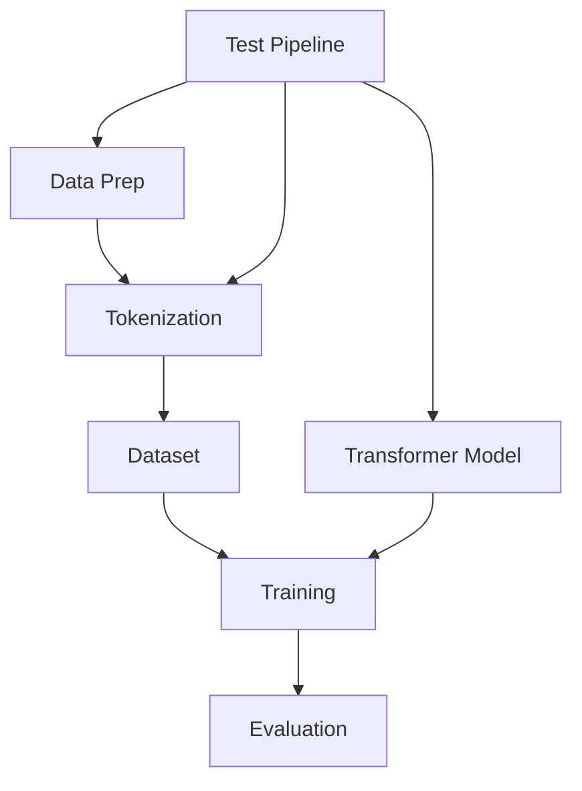

# DravidianLangTech-2026 : Abusive-Tamil-Text-Detection-Targeting-Women-on-Social-Media

Our Submission to the tak aims to detect abusive Tamil text targeting women on social media. It involves **preparing raw text data** by cleaning and labeling it, then **tokenizing** this text into a format suitable for machine learning. A *Transformer model* (like IndicBERT or XLM-RoBERTa) is used as the core deep learning architecture, with a *custom PyTorch dataset* efficiently managing the tokenized data. The entire **training and evaluation lifecycle** is **orchestrated** using a `Trainer` class, and the model's effectiveness is rigorously **evaluated and visualized** through various metrics and plots. Finally, the fine-tuned model is used to **predict on unseen test data** and generate a submission file.

## Visual Overview

## Steps

1. [Transformer Model](readme_files/01_transformer_model_.md)
2. [Data Preparation](readme_files/02_data_preparation_.md)
3. [Text Tokenization](readme_files/03_text_tokenization_.md)
4. [Custom PyTorch Dataset](readme_files/04_custom_pytorch_dataset_.md)
5. [Training](readme_files/05_training_orchestration_.md)
6. [Performance Evaluation & Visualization](readme_files/06_performance_evaluation___visualization_.md)
7. [Test Data Prediction and Submission](readme_files/07_test_data_prediction_and_submission_.md)

---
