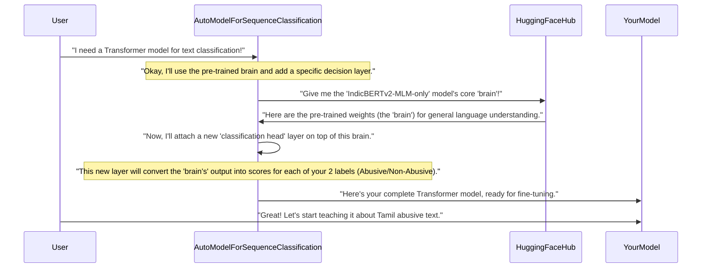

# Step 1: Transformer Model

First Question in our mind : How can a computer possibly understand the nuances of human language, especially something as sensitive as abuse? It's not as simple as looking for a few bad words! Traditional computer programs struggle with language because it's full of context, slang, and cultural intricacies.

That's where **Transformer Models** come in! Think of a Transformer model as a **super-smart language brain** for computers. It's an advanced deep learning architecture designed to process and understand human language better than ever before. For our project, the Transformer model is the core "intelligence" that will learn to distinguish between abusive and non-abusive Tamil text.

Our main goal is to understand what a Transformer model is and how we can use it for our specific task: detecting abusive Tamil text.

## What Makes Transformers So Special?

Let's break down the key ideas behind Transformer models.

1.  **A Universal Language Brain**: Imagine a very intelligent student who has read *millions* of books, articles, and websites in many languages. This student has learned general patterns, grammar, meanings of words, and even how different words relate to each other. Transformer models are like that student. They are first **pre-trained** on vast amounts of text data from the internet. This pre-training gives them a broad understanding of language, making them very knowledgeable about how words and sentences work. For Tamil, we use specialized Transformer models like **IndicBERT** or **XLM-RoBERTa**, which have been pre-trained on a lot of Indian languages, including Tamil.

2.  **Learning Our Specific "Language" (Fine-tuning)**: After learning general language skills, our smart student (the pre-trained Transformer) can be further trained for a specific task. This process is called **fine-tuning**. For our project, we'll take a pre-trained Transformer (like IndicBERT) and then train it specifically on *our* dataset of abusive and non-abusive Tamil texts. During fine-tuning, the model adjusts its "brain" to become very good at *our* particular task of identifying abusive language. It learns the subtle patterns and contexts that indicate abuse in Tamil.

3.  **Our Toolkit: The `transformers` Library**: Building these complex models from scratch is incredibly hard. Thankfully, we have powerful tools! The `transformers` library by Hugging Face is like a Swiss Army knife for working with Transformer models. It makes it super easy to load pre-trained models, fine-tune them, and use them for different language tasks.

4.  **Our Specific Tool: `AutoModelForSequenceClassification`**: For tasks where we want to classify a piece of text (like "Is this Tamil text abusive or not?"), the `transformers` library provides a special tool called `AutoModelForSequenceClassification`. This tool helps us load a pre-trained Transformer and automatically adds extra layers on top of its "brain" that are specifically designed for classification.

## Using a Transformer for Abusive Text Detection

Let's look at how we load such a powerful model using Python and the `transformers` library. The goal is to get a model ready to classify Tamil text.

First, we define which pre-trained Transformer we want to use. In our project, we use models like "ai4bharat/IndicBERTv2-MLM-only" or "xlm-roberta-base".

```python
from transformers import AutoModelForSequenceClassification

# Choose a pre-trained model name
model_name = "ai4bharat/IndicBERTv2-MLM-only"

# Define what our labels mean (0 for Non-Abusive, 1 for Abusive)
id2label = {0: "Non-Abusive", 1: "Abusive"}
label2id = {"Non-Abusive": 0, "Abusive": 1}

# Load the Transformer model, ready for our classification task
model = AutoModelForSequenceClassification.from_pretrained(
    model_name,
    num_labels=2, # We have 2 types of classes: Abusive and Non-Abusive
    id2label=id2label,
    label2id=label2id
)

# If we have a GPU, we move the model to the GPU for faster computations
# model.cuda()
```
### What's happening in this code?
*   `model_name`: This variable holds the name of the pre-trained Transformer model we want to use. Hugging Face's `transformers` library makes it easy to access hundreds of these models just by their name.
*   `id2label` and `label2id`: These are dictionaries that help the model understand our categories. `0` will mean "Non-Abusive", and `1` will mean "Abusive".
*   `AutoModelForSequenceClassification.from_pretrained(...)`: This is the magic line!
    *   It looks up the `model_name` on the Hugging Face Model Hub.
    *   It downloads the huge pre-trained "brain" (weights) of that Transformer model.
    *   It then attaches a special "classification head" (a few extra layers of neurons) on top of the Transformer's brain. This head is designed to give us an output that corresponds to our `num_labels` (in our case, 2 classes: Abusive or Non-Abusive).
    *   `num_labels=2`: This tells the model how many different types of categories we want it to predict (Abusive or Non-Abusive).
    *   `id2label` and `label2id`: These help the model map its numerical predictions (0 or 1) back to our human-readable labels ("Non-Abusive" or "Abusive").
*   `model.cuda()`: If you have a powerful graphics card (GPU), this line moves the model to the GPU. This makes computations much, much faster, which is very important for training large deep learning models.

**Example Input/Output**:
*   **Input to `from_pretrained`**: The `model_name` ("ai4bharat/IndicBERTv2-MLM-only") and configuration for our task (`num_labels=2`, `id2label`, `label2id`).
*   **Output of `from_pretrained`**: A `model` object. This object is a fully constructed deep learning model, pre-trained on a vast amount of text and ready to be fine-tuned on our specific abusive Tamil text dataset. It's essentially the "language brain" with an attached "decision-making" part for classification.

## Under the Hood: How `AutoModelForSequenceClassification` Works

Let's simplify how `AutoModelForSequenceClassification.from_pretrained` prepares our model.

Think of it like setting up a specialized workstation.



In essence, `AutoModelForSequenceClassification` is a clever function that:
1.  **Fetches the Foundation**: It connects to the Hugging Face Model Hub (a massive online library of models) and downloads the pre-trained core of the Transformer (e.g., IndicBERT's general language understanding abilities).
2.  **Adds a Custom Head**: It then intelligently adds a new set of neural network layers on top of this pre-trained foundation. These new layers are specifically designed to output classification scores for the number of labels you specify (`num_labels=2` for Abusive/Non-Abusive). This "head" is initially untrained for our specific task.
3.  **Combines and Configures**: It combines the pre-trained "body" and the new "head" into one complete model. It also sets up the model with your provided `id2label` and `label2id` mappings, so when it predicts `0`, it knows that means "Non-Abusive," and `1` means "Abusive."

The code snippet from `indicBert-v2.ipynb` and `xlm-roberta-base-vf.ipynb` exactly shows this:

From `indicBert-v2.ipynb`:
```python
# ... (imports and data loading) ...
model_name = "ai4bharat/IndicBERTv2-MLM-only"
# ... (tokenizer loading) ...
model = AutoModelForSequenceClassification.from_pretrained(model_name,num_labels=2)
# ... (further processing) ...
```

From `xlm-roberta-base-vf.ipynb`:
```python
# ... (imports and data loading) ...
MODEL_NAME = "xlm-roberta-base"
# ... (tokenizer loading) ...
model = AutoModelForSequenceClassification.from_pretrained(
    MODEL_NAME,
    num_labels=2,
    id2label=id2label,
    label2id=label2id
).cuda()
# ... (further processing) ...
```
Both snippets perform the same core action: loading a pre-trained Transformer and configuring it for a 2-class sequence classification task. The `.cuda()` call simply tells the model to use the GPU if one is available, which significantly speeds up computation.

Let's move on to the next Step : [Data Preparation](02_data_preparation_.md)!

---

<sub><sup>**References**: [[1]](https://github.com/itz-me-pandian/Abusive-Tamil-Text-Detection-Targeting-Women-on-Social-Media-DravidianLangTech-2026/blob/3f1cca4beda0e4410bde305e41221a2c46393ec0/indicBert-v2.ipynb), [[2]](https://github.com/itz-me-pandian/Abusive-Tamil-Text-Detection-Targeting-Women-on-Social-Media-DravidianLangTech-2026/blob/3f1cca4beda0e4410bde305e41221a2c46393ec0/xlm-roberta-base-vf.ipynb)</sup></sub>


