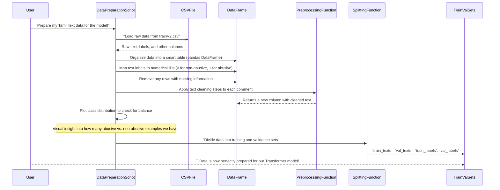

# Step 2: Data Preparation

 In [Step 1: Transformer Model](01_transformer_model_.md), we got familiar with Transformer models, our "super-smart language brain" for computers. We saw how to load a powerful pre-trained model that's ready to learn. But what does a super-smart brain need to learn? **Data!**

Think about teaching a child to identify different types of fruits. You wouldn't just tell them "apple," you'd show them many different apples – red ones, green ones, big ones, small ones. You'd also make sure they know what *isn't* an apple (like a banana). Our Transformer model is similar: it needs lots of examples of Tamil text, clearly labeled as either "Abusive" or "Non-Abusive," to learn effectively.

The raw data (thanks to the Dravidian LangTech 2026 for dataset) we get from social media isn't always neat and tidy. It can be full of typos, strange symbols, extra spaces, or even missing information. Trying to teach a model with such messy data is like trying to teach a child with blurry, incomplete pictures – they won't learn well!

That's why **Data Preparation** is so crucial. It's the process of taking our raw, messy social media comments and transforming them into a clean, organized, and understandable format that our Transformer model can actually learn from. In this Step, we'll learn how to take a simple CSV file of Tamil social media comments and prepare it for our detection model.

---

## What Does "Data Preparation" Involve?

Data preparation isn't a single step; it's a series of actions that get our data ready. Here are the key ideas we'll cover:

1.  **Loading the Data**: Getting our raw text from files into a format Python(dataframe) can work with.
2.  **Understanding and Structuring Data**: Looking at our labels, mapping them to numbers, and handling any missing pieces.
3.  **Cleaning the Text**: Making the actual Tamil text consistent and free from noise.
4.  **Visualizing Data Balance**: Checking if we have enough examples of both "Abusive" and "Non-Abusive" text.
5.  **Splitting Data**: Dividing our data into parts for training and testing the model.

Let's dive into each of these steps!

### 2.1 Loading the Data

Our project's data, like many real-world datasets, is stored in a Comma Separated Values (CSV) file. This is like a spreadsheet, but simpler. Python has a fantastic library called `pandas` that helps us work with such data easily. It turns our CSV file into a `DataFrame`, which is like a smart table.

First, we need to import `pandas`.

```python
import pandas as pd # 'pd' is a common short name for pandas
```

Now, let's load our training data. We'll use a placeholder path for the actual file.

```python
# Path to our training data CSV file (Provided Dataset is in the Specified path)
train_path = "/content/drive/Shareddrives/NLP Task/trainV2.csv"

# Load the CSV file into a pandas DataFrame
df = pd.read_csv(train_path)

# Display the first few rows to see what it looks like
print(df.head())
```

**What's happening here?**
*   `pd.read_csv(train_path)`: This command reads the data from our CSV file and puts it into `df`, a `DataFrame`.
*   `df.head()`: This shows us the top 5 rows of our DataFrame, giving us a quick peek at the data's structure and content. This helps confirm it loaded correctly.

You'll see columns like `Text` (the actual Tamil comment) and `Class` (its label, e.g., "Non-Abusive", "Abusive").

### 2.2 Understanding and Structuring Data

Once loaded, we need to inspect and refine our data.

#### **Handling Labels**

Computers prefer numbers, not text labels. Our labels ("Non-Abusive", "Abusive") need to be converted to numerical IDs (e.g., 0 for "Non-Abusive", 1 for "Abusive"). We also notice from the raw data that sometimes 'abusive' is lowercase, which should also map to 1.

```python
# Define a mapping from text labels to numerical IDs
label_map = {"Non-Abusive": 0, "Abusive": 1, "abusive": 1}

# Create a new 'label' column in our DataFrame using this map
df["label"] = df["Class"].map(label_map)

print(df[['Class', 'label']].head())
```

**What's happening here?**
*   `label_map`: This is a dictionary that tells `pandas` how to convert our text labels.
*   `df["Class"].map(label_map)`: This applies our `label_map` to every value in the `Class` column, creating a new `label` column with numbers.

#### **Handling Missing Entries (But Our dataset shows no null entries)**

Sometimes, data rows can have empty or "missing" values. This can cause problems later. It's good practice to check for and remove these rows.

```python
# Remove any rows that have missing values (NaN) in any column
# .reset_index(drop=True) makes sure the row numbers are neat after removing rows
df = df.dropna().reset_index(drop=True)

print(f"Number of rows after dropping missing values: {len(df)}")
```

**What's happening here?**
*   `df.dropna()`: This method finds any row where at least one value is missing (NaN - "Not a Number" or "Not Available") and removes that entire row.
*   `.reset_index(drop=True)`: After removing rows, the original row numbers might have gaps. This command re-indexes the DataFrame starting from 0, making it clean.

### 2.3 Cleaning the Text

This is where we make our text neat and consistent. Social media text can be really messy! We'll write a Python function to perform several cleaning steps.

```python
import re
import unicodedata

def preprocess(text):
    text = str(text) # Ensure text is a string
    # 1. Normalize characters (e.g., handle different forms of Tamil characters)
    text = unicodedata.normalize("NFC", text)
    # 2. Replace HTML entities like &#39; with an apostrophe '
    text = text.replace("&#39;", "'")
    # 3. Standardize whitespace (multiple spaces to single space, remove leading/trailing)
    text = re.sub(r"\\s+", " ", text).strip()
    # 4. Convert English letters to lowercase (if any mixed in Tamil text)
    text = re.sub(r"[A-Za-z]+", lambda m: m.group(0).lower(), text)
    return text

# Apply the preprocessing function to our 'Text' column
df["clean_text"] = df["Text"].apply(preprocess)

print("Original Text Example:", df["Text"].iloc[1])
print("Cleaned Text Example:", df["clean_text"].iloc[1])
```

**What's happening in this `preprocess` function?**
*   `unicodedata.normalize("NFC", text)`: Tamil, like many languages, can have characters represented in different ways (e.g., a base character followed by a combining mark, or a single precomposed character). Normalization ensures all similar characters are represented consistently.
*   `text.replace("&#39;", "'")`: This fixes common HTML-like encoding issues, converting `&#39;` (the HTML entity for an apostrophe) back to a regular apostrophe.
*   `re.sub(r"\\s+", " ", text).strip()`: This uses regular expressions (`re`) to:
    *   Replace any sequence of one or more whitespace characters (`\s+`) with a single space.
    *   `.strip()` removes any spaces from the very beginning or end of the text.
*   `re.sub(r"[A-Za-z]+", ..., text)`: This finds any English alphabet letters (`[A-Za-z]+`) and converts them to lowercase. While our primary data is Tamil, social media often has mixed language content.

After defining the function, `df["Text"].apply(preprocess)` runs this `preprocess` function on every single comment in our `Text` column and saves the result in a new `clean_text` column.

### 2.4 Visualizing Class Distribution

Our model learns by seeing examples. If it sees 99 non-abusive examples for every 1 abusive example, it might become very good at predicting "non-abusive" but terrible at finding actual abusive content. This is called **class imbalance**. We can check this by plotting the distribution of our labels.

```python
import matplotlib.pyplot as plt
import seaborn as sns

plt.figure(figsize=(6, 4)) # Set the size of the plot
sns.countplot(x=df["label"]) # Create a bar plot of label counts
plt.xticks([0, 1], ["Non-Abusive", "Abusive"]) # Label the x-axis ticks
plt.title("Class Distribution")
plt.xlabel("Class")
plt.ylabel("Count")
plt.show()
```

**What's happening here?**
*   `sns.countplot()`: `seaborn` is a library built on `matplotlib` that makes creating nice statistical plots easier. `countplot` is perfect for showing how many items fall into each category (our classes 0 and 1).
*   The plot helps us visually confirm if one class has significantly more examples than the other. If there's a big imbalance, we might need special techniques (like using `class_weights` during training, as seen in `xlm-roberta-base-vf.ipynb`) to make sure the model learns from both classes fairly.

### 2.5 Splitting Data for Training and Validation

To ensure our model can generalize (make good predictions on new, unseen data), we need to split our dataset. We'll train the model on one part (the **training set**) and evaluate its performance on another part it has never seen before (the **validation set**).

```python
from sklearn.model_selection import train_test_split

# Split the 'clean_text' and 'label' columns
train_texts, val_texts, train_labels, val_labels = train_test_split(
    df["clean_text"].tolist(), # Convert cleaned texts to a list
    df["label"].tolist(),     # Convert labels to a list
    test_size=0.15,           # Use 15% of data for validation
    random_state=42,          # For reproducible splits (same split every time)
    stratify=df["label"]      # Important: Keep the same class distribution in both splits
)

print(f"Training data size: {len(train_texts)} samples")
print(f"Validation data size: {len(val_texts)} samples")
```

**What's happening here?**
*   `train_test_split()`: This handy function from `sklearn` (Scikit-learn) does the splitting for us.
*   `test_size=0.15`: This means 15% of our data will go to the validation set, and the remaining 85% to the training set.
*   `random_state=42`: This is like a "seed" for random operations. Using the same `random_state` ensures that if you run the code again, you'll get the exact same split, which is great for reproducibility.
*   `stratify=df["label"]`: This is crucial for imbalanced datasets! It tells `train_test_split` to make sure the *proportion* of abusive and non-abusive texts is roughly the same in both the training and validation sets as it is in the original `df["label"]`. This ensures both sets are representative.

---

## Under the Hood: The Data Preparation Pipeline

Let's visualize the entire journey our raw data takes from a CSV file to ready-to-use training and validation sets.



**Code References from Project Files:**

You can see these steps directly implemented in the `indicBert-v2.ipynb` and `xlm-roberta-base-vf.ipynb` files.

1.  **Loading the Dataset (`df = pd.read_csv(...)`) and Label Mapping (`df["label"] = df["Class"].map(label_map)`):**
    These lines, common to both notebooks, bring our raw data into a DataFrame and assign numerical labels. In `indicBert-v2.ipynb`, you'll find it under the `Loading Dataset` section:

    ```python
    # From indicBert-v2.ipynb:
    train_path = "/content/drive/Shareddrives/NLP Task/trainV2.csv"
    # ... (test_path defined here too) ...
    df = pd.read_csv(train_path)

    label_map = {"Non-Abusive": 0, "Abusive": 1, "abusive": 1}
    df["label"] = df["Class"].map(label_map)
    ```

    The `xlm-roberta-base-vf.ipynb` does something very similar to load data and set up labels. Note that it also explicitly drops `NaN` values:

    ```python
    # From xlm-roberta-base-vf.ipynb:
    train_df = pd.read_csv("/kaggle/input/attc-dataset/trainV2.csv")
    # ... (test_df loaded here) ...
    train_df = train_df.dropna().reset_index(drop=True)
    # ... (label2id and id2label dictionaries defined) ...
    train_df["label"] = train_df["Class"].map(label2id)
    ```

2.  **Text Preprocessing (`preprocess` function and `df["clean_text"] = df["Text"].apply(preprocess)`):**
    The `preprocess` function we discussed is present in `indicBert-v2.ipynb` under the `Preprocessing` section. `xlm-roberta-base-vf.ipynb` skips this step, implying their chosen tokenizer might handle some of these aspects, or the dataset was already sufficiently clean for their pipeline after basic `dropna`.

    ```python
    # From indicBert-v2.ipynb:
    def preprocess(text):
        text = str(text)
        text = unicodedata.normalize("NFC", text)
        text = text.replace("&#39;", "'")
        text = re.sub(r"\\s+", " ", text).strip()
        text = re.sub(r"[A-Za-z]+", lambda m: m.group(0).lower(), text)
        return text

    df["clean_text"] = df["Text"].apply(preprocess)
    ```

3.  **Class Distribution Visualization (`df["label"].value_counts().plot(...)` or `sns.countplot(...)`):**
    Both notebooks visualize the class distribution. `indicBert-v2.ipynb` uses `matplotlib` directly, while `xlm-roberta-base-vf.ipynb` leverages `seaborn` for a slightly more polished look.

    ```python
    # From indicBert-v2.ipynb (Class Distribution Graph):
    plt.figure()
    df["label"].value_counts().plot(kind="bar")
    plt.xticks([0,1], ["Non-Abusive","Abusive"], rotation=0)
    plt.title("Class Distribution")
    plt.xlabel("Class")
    plt.ylabel("Count")
    # ... (savefig and show) ...
    ```

    ```python
    # From xlm-roberta-base-vf.ipynb (Class Distribution):
    plt.figure()
    sns.countplot(x=train_df["Class"]) # Note: It plots 'Class' which still has 'abusive'
    plt.title("Class Distribution")
    plt.xlabel("Class")
    plt.ylabel("Count")
    plt.show()
    ```

4.  **Train/Validation Split (`train_test_split(...)`):**
    This critical step is also found in both notebooks. Notice the use of `random_state` and `stratify` to ensure robust splitting.

    ```python
    # From indicBert-v2.ipynb (Train / Validation Split):
    train_texts, val_texts, train_labels, val_labels = train_test_split(
        df["clean_text"].tolist(), # Using the 'clean_text' column
        df["label"].tolist(),
        test_size=0.1,
        random_state=42,
        stratify=df["label"]
    )
    ```

    ```python
    # From xlm-roberta-base-vf.ipynb (Train Validation Split):
    train_texts, val_texts, train_labels, val_labels = train_test_split(
        train_df["Text"].tolist(), # Using the original 'Text' column, implying tokenizer handles cleaning
        train_df["label"].tolist(),
        test_size=0.15,
        stratify=train_df["label"],
        random_state=SEED # SEED is defined as 42 earlier in this notebook
    )
    ```
    You'll notice `xlm-roberta-base-vf.ipynb` splits the original `Text` column, while `indicBert-v2.ipynb` uses the `clean_text` column. This highlights that cleaning steps can sometimes be handled by the tokenizer (which we'll cover in the next Step!) or done explicitly beforehand.

---

## Conclusion

In this step, we've transformed our raw social media data into a well-structured and clean format, ready for our Transformer model. We learned how to:
*   Load data using `pandas`.
*   Map text labels to numerical IDs and handle missing information.
*   Clean messy text by normalizing characters, removing special symbols, and standardizing whitespace and casing.
*   Visualize class distribution to understand our dataset's balance.
*   Split our data into training and validation sets for fair model evaluation.

Now that our data is prepared, the next crucial step is to convert this clean text into a numerical format that our Transformer model can actually process. This process is called "tokenization," and we'll explore it in the next step!

Let's move on to the next [Step 3: Text Tokenization](03_text_tokenization_.md)!

---

<sub><sup>**References**: [[1]](https://github.com/itz-me-pandian/Abusive-Tamil-Text-Detection-Targeting-Women-on-Social-Media-DravidianLangTech-2026/blob/3f1cca4beda0e4410bde305e41221a2c46393ec0/indicBert-v2.ipynb), [[2]](https://github.com/itz-me-pandian/Abusive-Tamil-Text-Detection-Targeting-Women-on-Social-Media-DravidianLangTech-2026/blob/3f1cca4beda0e4410bde305e41221a2c46393ec0/xlm-roberta-base-vf.ipynb)</sup></sub>
