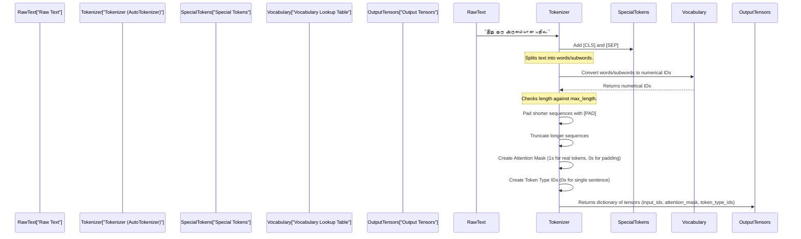

# Chapter 3: Text Tokenization

 In [Step 2: Data Preparation](02_data_preparation_.md), We transformed raw, messy text into neat lists of `clean_text` and their corresponding numerical `label` IDs (0 for non-abusive, 1 for abusive). Great job!

Now, imagine you have a beautifully cleaned Tamil sentence like: "இது ஒரு நல்ல பதிவு." (This is a good post.) Your human brain understands this immediately. But what about our super-smart Transformer model from [Step 1: Transformer Model](01_transformer_model_.md)? It's a computer, and computers don't understand words like "இது" or "நல்ல" directly. They only understand **numbers**.

This is where **Text Tokenization** comes in! It's the crucial step that acts like a translator, converting our human-readable, cleaned text into a language our Transformer model can actually process: a sequence of numerical IDs.

## What Problem Does Tokenization Solve?

Think of it this way: our Transformer model is like a calculator. It can do amazing things, but only if you give it numbers. Tokenization is the process of taking words (or parts of words) and giving them a unique numerical code.

But it's not just about converting words to numbers! Social media posts are often short, but sometimes they can be long. Transformer models, like the ones we're using (IndicBERT, XLM-RoBERTa), expect all inputs to be of a **consistent length**. Tokenization also handles this "making everything uniform" task.

So, the main goal of this step is to understand:
1.  How to break text into smaller pieces called **tokens**.
2.  How to convert these tokens into **numerical IDs**.
3.  How to prepare additional information like **attention masks** and **segment IDs**.
4.  How to make sure all input texts are the **same length** using padding and truncation.

## Key Concepts in Tokenization

Let's break down the main ideas behind turning text into numbers for our model.

### 3.1 Tokens and Numerical IDs

Imagine you have a dictionary where every word or part of a word has a unique number. That's essentially what a tokenizer does!

*   **Tokens**: These are the basic building blocks of text that the model understands. Sometimes, a token is a whole word (like "அம்மா"). Other times, it's a "subword" (like "அம்" and "மா"). Subword tokenization is common because it helps handle new or misspelled words without needing a huge vocabulary for every single word in a language.
*   **Numerical IDs**: Each unique token is assigned a unique number. So, "அம்மா" might be `1234`, "நான்" might be `5678`, and a special token for "start of sentence" might be `101`. These numbers are the actual input to our Transformer model.

### 3.2 Attention Masks

Not all sentences are the same length. Some are short, some are long. But our Transformer model prefers to process batches of sentences that *all have the same length*. To achieve this, tokenizers use:

*   **Padding**: If a sentence is shorter than the desired maximum length, special `[PAD]` tokens (which have their own unique numerical ID, usually 0) are added to make it longer.
*   **Truncation**: If a sentence is too long, the tokenizer will cut off the extra tokens from the end to fit the `max_length`.

The **attention mask** is a list of 1s and 0s that tells the model: "Hey, these tokens are real words (1s), but these other tokens are just padding (0s), so ignore them!" This is super important so the model doesn't waste its "attention" on empty spaces.

### 3.3 Segment IDs (or Token Type IDs)

Sometimes, Transformer models are used for tasks that involve two sentences, like "Is sentence B an answer to sentence A?" In such cases, we need to tell the model which tokens belong to sentence A and which belong to sentence B. This is done using **segment IDs** (also called **token type IDs**).

*   Tokens from the first sentence get `0`.
*   Tokens from the second sentence get `1`.

For our abusive text detection project, we are only classifying single sentences at a time. So, our segment IDs will usually be all zeros, or the tokenizer will implicitly handle it as a single segment.

### 3.4 Maximum Length (`max_length`)

Every Transformer model has a limit on how many tokens it can process at once. This limit is its `max_length`. For example, many models have a `max_length` of 128, 256, or 512 tokens.

Choosing the right `max_length` is important:
*   Too short: You might cut off important information from longer texts.
*   Too long: It uses more memory and takes longer to process, and most of your shorter texts might just be filled with padding.

In [Step 2: Data Preparation](02_data_preparation_.md), we visualized the text length distribution. This helps us decide on a reasonable `max_length` that captures most sentences without too much padding or truncation.

## Tokenizing Our Tamil Text

Let's see how we can use the `transformers` library to perform tokenization. Our main tool here is the `AutoTokenizer`. Just like `AutoModelForSequenceClassification` helped us load a model easily, `AutoTokenizer` helps us load the right tokenizer for our chosen Transformer model.

First, we need to import `AutoTokenizer`:

```python
from transformers import AutoTokenizer

# Choose the same pre-trained model name we used for the Transformer model
model_name = "ai4bharat/IndicBERTv2-MLM-only" # Or "xlm-roberta-base"

# Load the tokenizer associated with our chosen model
tokenizer = AutoTokenizer.from_pretrained(model_name)
```
**What's happening here?**
*   `model_name`: This specifies which pre-trained model's tokenizer we want to load. It's crucial to use the *same* model name for both the tokenizer and the model because they are designed to work together.
*   `AutoTokenizer.from_pretrained(model_name)`: This function:
    *   Looks up the tokenizer for `model_name` on the Hugging Face Model Hub.
    *   Downloads the tokenizer's vocabulary and rules.
    *   Creates a `tokenizer` object that we can use to convert text into numerical inputs.

### Example: Tokenizing a Single Sentence

Let's take a sample Tamil sentence and see what the tokenizer does.

```python
# A sample Tamil sentence
sample_text = "இது ஒரு அருமையான பதிவு." # This is an awesome post.

# Tokenize the sample text
encoded_input = tokenizer(sample_text, padding=True, truncation=True, max_length=128, return_tensors="pt")

print("Original Text:", sample_text)
print("\nEncoded Input (Dictionary):")
print(encoded_input)
print("\nInput IDs (Numerical Tokens):")
print(encoded_input['input_ids'][0])
print("\nAttention Mask:")
print(encoded_input['attention_mask'][0])
```
**Example Output (simplified for clarity):**
```
Original Text: இது ஒரு அருமையான பதிவு.

Encoded Input (Dictionary):
{'input_ids': tensor([[ 2, 829, 2199, 13735, 17972, 638, 4, 0, 0, ...]]), 
 'attention_mask': tensor([[1, 1, 1, 1, 1, 1, 1, 0, 0, ...]]), 
 'token_type_ids': tensor([[0, 0, 0, 0, 0, 0, 0, 0, 0, ...]])}

Input IDs (Numerical Tokens):
tensor([    2,   829,  2199, 13735, 17972,   638,     4,     0,     0,     0,
            0,     0,     0,     0,     0,     0,     0,     0,     0,     0, ...])

Attention Mask:
tensor([1, 1, 1, 1, 1, 1, 1, 0, 0, 0, 0, 0, 0, 0, 0, 0, 0, 0, 0, 0, ...])
```
**What's happening in this output?**
*   **`encoded_input`**: This is a dictionary containing the numerical representations.
*   **`input_ids`**: This is the core output. It's a list of numbers where each number corresponds to a specific token. You'll notice:
    *   `2`: Often represents the special `[CLS]` token (for "classification") at the beginning of a sequence.
    *   `4`: Often represents the special `[SEP]` token (for "separator") marking the end of a sentence.
    *   `0`: Represents the `[PAD]` tokens used for padding.
*   **`attention_mask`**: This is a list of 1s (for actual tokens including `[CLS]` and `[SEP]`) and 0s (for `[PAD]` tokens). It tells the model to focus only on the non-zero values.
*   **`token_type_ids`**: For our single-sentence task, these are all 0s, indicating all tokens belong to the same segment.
*   **`padding=True`**: This tells the tokenizer to add `[PAD]` tokens if the sequence is shorter than `max_length`.
*   **`truncation=True`**: This tells the tokenizer to cut off tokens if the sequence is longer than `max_length`.
*   **`max_length=128`**: All output sequences will be exactly 128 tokens long.
*   **`return_tensors="pt"`**: This tells the tokenizer to return PyTorch tensors, which are required for our PyTorch-based Transformer model.

### Tokenizing Our Training and Validation Data

Now, let's apply this tokenization process to our `train_texts` and `val_texts` (the cleaned lists of Tamil comments from [Step 2: Data Preparation](02_data_preparation_.md)).

```python
# A simple function to tokenize a list of texts
def tokenize_texts(texts):
    return tokenizer(
        texts,
        padding=True,          # Pad all sequences to the same length
        truncation=True,       # Truncate sequences longer than max_length
        max_length=128,        # Set a fixed maximum length for all sequences
        return_tensors="pt"    # Return PyTorch tensors
    )

# Tokenize our training and validation texts
train_encodings = tokenize_texts(train_texts)
val_encodings = tokenize_texts(val_texts)

print("Training Encoded Input Keys:", train_encodings.keys())
print("First Training Input IDs (showing 5 tokens):", train_encodings['input_ids'][0][:5])
print("First Validation Attention Mask (showing 5 tokens):", val_encodings['attention_mask'][0][:5])
```
**What's happening here?**
*   `tokenize_texts` function: This is a reusable function that wraps the tokenizer with our desired settings (`padding`, `truncation`, `max_length`, `return_tensors`).
*   `train_encodings` and `val_encodings`: These variables now hold dictionaries, just like `encoded_input` for the single sentence, but containing the tokenized data for all our training and validation samples. Each key (`input_ids`, `attention_mask`, `token_type_ids`) will hold a large PyTorch tensor.

## Under the Hood: The Tokenization Process

Let's visualize the step-by-step process of how a tokenizer converts your raw text into the numerical format a Transformer model can understand.



**Code References from Project Files:**

You can see these tokenization steps directly implemented in the `indicBert-v2.ipynb` and `xlm-roberta-base-vf.ipynb` files.

1.  **Loading the Tokenizer (`tokenizer = AutoTokenizer.from_pretrained(model_name)`):**
    Both notebooks load the tokenizer for their respective models.

    ```python
    # From indicBert-v2.ipynb:
    model_name = "ai4bharat/IndicBERTv2-MLM-only"
    tokenizer = AutoTokenizer.from_pretrained(model_name)
    ```

    ```python
    # From xlm-roberta-base-vf.ipynb:
    MODEL_NAME = "xlm-roberta-base"
    tokenizer = AutoTokenizer.from_pretrained(MODEL_NAME)
    ```

2.  **Tokenizing the Datasets (`train_encodings = tokenize(train_texts)` / `AbuseDataset`):**
    The `indicBert-v2.ipynb` notebook defines a `tokenize` function similar to our example and then applies it. The `xlm-roberta-base-vf.ipynb` integrates tokenization directly into a custom dataset class (which we'll discuss in the next chapter!).

    ```python
    # From indicBert-v2.ipynb:
    def tokenize(texts):
        return tokenizer(texts, padding=True, truncation=True, max_length=128)

    train_encodings = tokenize(train_texts)
    val_encodings = tokenize(val_texts)
    ```

    In `xlm-roberta-base-vf.ipynb`, the tokenization happens within the `__getitem__` method of the `AbuseDataset` class:

    ```python
    # From xlm-roberta-base-vf.ipynb (inside AbuseDataset's __getitem__):
    class AbuseDataset(torch.utils.data.Dataset):
        # ... (init method) ...
        def __getitem__(self, idx):
            enc = self.tokenizer(
                self.texts[idx],
                truncation=True,
                max_length=128
            )
            # ... (add labels) ...
            return enc

    # Datasets are then created using this class:
    train_dataset = AbuseDataset(train_texts, tokenizer, train_labels)
    # ...
    ```
    Both approaches achieve the same outcome: converting our cleaned text into numerical inputs suitable for the Transformer model, with appropriate padding and truncation.

## Conclusion

In this step, we did the essential process breaks down raw text into numerical tokens, adds special control tokens, and ensures all sequences are of a consistent length using padding and truncation. We also saw how **attention masks** tell the model which parts are real text and which are just filler.

Now that our text data has been fully transformed into numerical inputs, the next step is to efficiently feed this data to our PyTorch Transformer model. This is where custom PyTorch datasets come into play!

Let's move on to the next [Step 4: Custom PyTorch Dataset](04_custom_pytorch_dataset_.md)!

---

<sub><sup>**References**: [[1]](https://github.com/itz-me-pandian/Abusive-Tamil-Text-Detection-Targeting-Women-on-Social-Media-DravidianLangTech-2026/blob/3f1cca4beda0e4410bde305e41221a2c46393ec0/indicBert-v2.ipynb), [[2]](https://github.com/itz-me-pandian/Abusive-Tamil-Text-Detection-Targeting-Women-on-Social-Media-DravidianLangTech-2026/blob/3f1cca4beda0e4410bde305e41221a2c46393ec0/xlm-roberta-base-vf.ipynb)</sup></sub>

