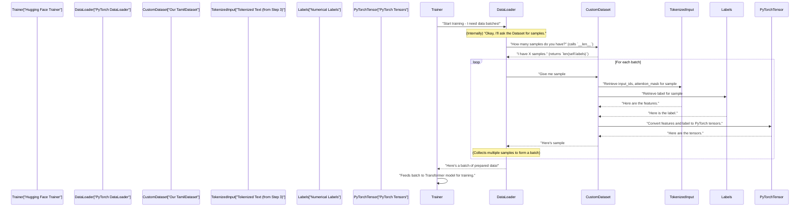

# Step 4: Custom PyTorch Dataset

 In Previous[Step 3: Text Tokenization](03_text_tokenization_.md), we successfully transformed our clean Tamil text into a numerical format – lists of `input_ids`, `attention_mask`, and `token_type_ids`. We also have our numerical `labels` (0 or 1) ready. Now, we have all our "ingredients" prepared!

But how do we actually give these ingredients to our powerful Transformer model? Deep learning models, especially during training, don't just process one sentence at a time. They learn much more efficiently when given data in **batches** – like a stack of 16 or 32 sentences at once.

This is where the **Custom PyTorch Dataset** comes in. Think of it as a meticulously organized recipe book or a smart pantry for our model. It's a specialized container that knows exactly how to store our tokenized texts and their labels, and how to hand out individual samples when asked.

## Why Do We Need a Custom Dataset?

PyTorch, the deep learning library we're using, has a standard way of handling data. It expects your data to be wrapped in a `Dataset` object. This `Dataset` class acts as an interface:
1.  It tells PyTorch **how many** samples are available in total.
2.  It knows **how to retrieve a single sample** (like the 5th sentence and its label).
3.  It ensures that when PyTorch asks for data, it always gets a consistent format (PyTorch tensors).

By creating our own "custom" dataset class, we tailor this standard interface to perfectly fit *our specific data* (tokenized Tamil texts and their labels). This design is crucial for efficiently managing and feeding data in batches to our Transformer model during training and evaluation.

## Building Our Custom Dataset: The Three Magical Methods

To create a custom PyTorch dataset, we need to define a Python class that inherits from PyTorch's `torch.utils.data.Dataset`. Inside this class, there are three special methods you *must* implement:

### 1. `__init__(self, encodings, labels)`: The Constructor

*   **Purpose**: This method is like setting up our "smart pantry." It's called when you first create an instance of your dataset (e.g., `train_dataset = MyDataset(...)`).
*   **What it does**: It takes your tokenized data (`train_encodings` and `train_labels` from Step 3) and stores them inside the dataset object. These will be the raw materials our dataset manages.

### 2. `__len__(self)`: The Length Teller

*   **Purpose**: This method tells PyTorch how many total individual data samples are in your dataset. PyTorch uses this to know when it has seen all the data (one "epoch").
*   **What it does**: It simply returns the total number of sentences (or labels) you have. For example, if you have 1000 sentences, `__len__` should return `1000`.

### 3. `__getitem__(self, idx)`: The Sample Retriever

*   **Purpose**: This is the most important method! It's how PyTorch asks for a *single specific data sample*. When PyTorch wants the 7th sample, it calls `__getitem__(6)` (because Python uses 0-based indexing).
*   **What it does**: Given an `idx` (index), it retrieves the `input_ids`, `attention_mask`, `token_type_ids` for that specific sentence, and its corresponding `label`. Crucially, it converts these into **PyTorch tensors** (PyTorch's special numerical arrays) because that's what our model expects. It returns them as a dictionary.

## Putting It Together: Our `TamilDataset` Class

Let's define a simple `TamilDataset` class to wrap our tokenized data and labels. We'll use `torch` for converting data to tensors.

```python
import torch

class TamilDataset(torch.utils.data.Dataset):
    def __init__(self, encodings, labels):
        # Store the tokenized encodings (input_ids, attention_mask, etc.)
        self.encodings = encodings
        # Store the numerical labels
        self.labels = labels

    def __len__(self):
        # Return the total number of samples in our dataset
        return len(self.labels)

    def __getitem__(self, idx):
        # Get the tokenized data for a specific index
        # {k: v[idx] for k, v in self.encodings.items()} gets the input_ids,
        # attention_mask, etc., for the 'idx'th sample.
        item = {k: torch.tensor(v[idx]) for k, v in self.encodings.items()}
        
        # Add the corresponding label for this sample, also as a PyTorch tensor
        item["labels"] = torch.tensor(self.labels[idx])
        
        # Return the dictionary containing the input features and its label
        return item

# Imagine train_encodings, val_encodings, train_labels, val_labels
# are from Step 3 (Text Tokenization)
# For example:
# train_encodings = {
#     'input_ids': [[101, 202, ...], [101, 303, ...]],
#     'attention_mask': [[1, 1, ...], [1, 1, ...]]
# }
# train_labels = [0, 1]

# Create instances of our custom dataset for training and validation
train_dataset = TamilDataset(train_encodings, train_labels)
val_dataset = TamilDataset(val_encodings, val_labels)

print(f"Number of training samples: {len(train_dataset)}")
print(f"Number of validation samples: {len(val_dataset)}")

# Example of what the first item in the training dataset would look like:
first_sample = train_dataset[0]
print("\nFirst sample from training dataset:")
print("Input IDs (first 5 tokens):", first_sample['input_ids'][:5])
print("Attention Mask (first 5 tokens):", first_sample['attention_mask'][:5])
print("Label:", first_sample['labels'])
```

**What's happening in this code?**
*   We define `TamilDataset` and ensure it inherits from `torch.utils.data.Dataset`.
*   In `__init__`, we simply take the `encodings` (the dictionary of tokenized inputs) and `labels` (the list of numerical labels) and store them as attributes of our dataset object.
*   `__len__` is straightforward: it returns the number of `labels`, which is equal to the number of samples.
*   `__getitem__(idx)` is where the magic happens:
    *   `item = {k: torch.tensor(v[idx]) for k, v in self.encodings.items()}`: This line efficiently goes through all the tokenized features (`input_ids`, `attention_mask`, etc.) in `self.encodings`. For each feature `k`, it grabs the `idx`-th entry (`v[idx]`) and converts it into a `torch.tensor`. This creates a dictionary like `{'input_ids': tensor([...]), 'attention_mask': tensor([...])}`.
    *   `item["labels"] = torch.tensor(self.labels[idx])`: We then add the corresponding `idx`-th label to this dictionary, also converted to a PyTorch tensor.
    *   The `item` dictionary is then returned. This is exactly the format our Transformer model expects for a single sample.

When you run this code, `len(train_dataset)` will call our `__len__` method, and `train_dataset[0]` will call our `__getitem__(0)` method to retrieve the first sample.

## Under the Hood: The Dataset's Role in Training

While our `Custom PyTorch Dataset` provides the organized data, it's typically used by another PyTorch component called `DataLoader`. The `DataLoader` is responsible for actually bundling individual samples (provided by our `Dataset`) into batches.

Let's visualize how our custom dataset works hand-in-hand with the `DataLoader` to feed data to the model.



In essence, our `TamilDataset` serves as the structured source from which the `DataLoader` efficiently pulls and aggregates individual samples, preparing them perfectly for the Transformer model.

### Code References from Project Files:

You can see the implementation of a custom dataset class directly in the `indicBert-v2.ipynb` and `xlm-roberta-base-vf.ipynb` files.

#### `indicBert-v2.ipynb` (`TamilDataset` class):

This notebook implements the `TamilDataset` class almost exactly as we discussed.

```python
# From indicBert-v2.ipynb:
# ... (imports, data loading, preprocessing, train/val split, tokenizer loading) ...

class TamilDataset(torch.utils.data.Dataset):
    def __init__(self, encodings, labels):
        self.encodings = encodings
        self.labels = labels

    def __len__(self):
        return len(self.labels)

    def __getitem__(self, idx):
        item = {k: torch.tensor(v[idx]) for k, v in self.encodings.items()}
        item["labels"] = torch.tensor(self.labels[idx])
        return item

train_dataset = TamilDataset(train_encodings, train_labels)
val_dataset = TamilDataset(val_encodings, val_labels)
```
As you can see, the structure precisely matches our explanation, taking pre-tokenized `encodings` and `labels` and organizing them.

#### `xlm-roberta-base-vf.ipynb` (`AbuseDataset` class):

This notebook takes a slightly different, but equally valid, approach. Instead of pre-tokenizing all texts and passing the encodings, it passes the *raw texts* and then tokenizes *inside* the `__getitem__` method. This can be useful for very large datasets where pre-tokenizing everything at once might consume too much memory.

```python
# From xlm-roberta-base-vf.ipynb:
# ... (imports, data loading, train/val split, tokenizer loading) ...

class AbuseDataset(torch.utils.data.Dataset):
    def __init__(self, texts, tokenizer, labels=None):
        self.texts = texts
        self.labels = labels # Labels can be None for test data
        self.tokenizer = tokenizer # The tokenizer is passed to the dataset

    def __len__(self):
        return len(self.texts)

    def __getitem__(self, idx):
        # Tokenization happens here, for each item
        enc = self.tokenizer(
            self.texts[idx],
            truncation=True,
            max_length=128 # Max length is specified here
        )

        if self.labels is not None:
            enc["labels"] = self.labels[idx] # Labels are added directly as Python integers

        return enc

# Example of creating the dataset:
train_dataset = AbuseDataset(train_texts, tokenizer, train_labels)
val_dataset   = AbuseDataset(val_texts, tokenizer, val_labels)
test_dataset  = AbuseDataset(test_df["Text"].tolist(), tokenizer) # No labels for test data
```
Notice the key differences:
*   The `__init__` method stores the `texts` (raw sentences) and `tokenizer` object.
*   The `__getitem__` method calls `self.tokenizer()` on `self.texts[idx]` to tokenize the specific sentence when it's requested.
*   It doesn't explicitly convert `labels` to `torch.tensor` immediately; this often happens later in the `DataCollator` (which we'll cover in the next Step) to handle batching and padding. But for `input_ids`, etc., the tokenizer already returns PyTorch tensors if `return_tensors="pt"` is used (though it's not shown explicitly in this snippet, `DataCollatorWithPadding` expects them or will convert them).

Both implementations achieve the same goal: providing PyTorch with a standardized way to access individual data samples.

## Conclusion

In this step, we've used and understood the critical role of a **Custom PyTorch Dataset** in deep learning. We understood that this class acts as a structured container for our tokenized text and labels, implementing `__init__`, `__len__`, and `__getitem__` to allow PyTorch to efficiently access our data. This setup is essential for preparing our data for the next phase: feeding it in batches to our Transformer model.

Now that our data is neatly organized within custom `Dataset` objects, the final step before training is to create `DataLoaders` that will handle the batching and feeding of this data to the model.

Let's move on to the next [Step 5: Training ](05_training_orchestration_.md)!

---

<sub><sup>**References**: [[1]](https://github.com/itz-me-pandian/Abusive-Tamil-Text-Detection-Targeting-Women-on-Social-Media-DravidianLangTech-2026/blob/3f1cca4beda0e4410bde305e41221a2c46393ec0/indicBert-v2.ipynb), [[2]](https://github.com/itz-me-pandian/Abusive-Tamil-Text-Detection-Targeting-Women-on-Social-Media-DravidianLangTech-2026/blob/3f1cca4beda0e4410bde305e41221a2c46393ec0/xlm-roberta-base-vf.ipynb)</sup></sub>

