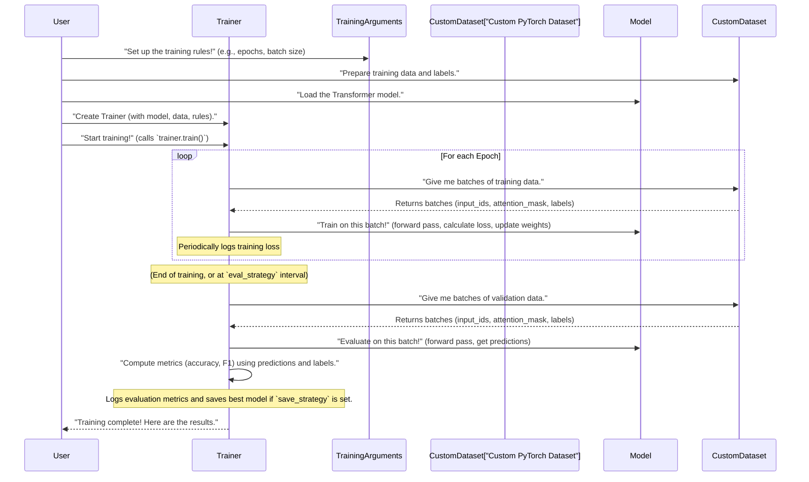

# Step 5: Training

 In [Step 4: Custom PyTorch Dataset](04_custom_pytorch_dataset_.md), we efficiently organized our tokenized Tamil texts and their labels into custom `Dataset` objects. We now have our ingredients: a powerful Transformer model ready to learn (from [Step 1: Transformer Model](01_transformer_model_.md)) and perfectly prepared data (from [Step 2: Data Preparation](02_data_preparation_.md), [Step 3: Text Tokenization](03_text_tokenization_.md), and [Step 4: Custom PyTorch Dataset](04_custom_pytorch_dataset_.md)).

But how do we actually *run the show*? How do we tell our model to start learning, make sure it learns well, and evaluate its progress? This is where **Training** comes in!

## What Problem Does Training Orchestration Solve?

Imagine you're a chef preparing a complex meal. You have all your ingredients chopped, measured, and ready (our prepared data and model). But you don't just throw everything into the oven and hope for the best! You need a recipe, a timer, and a plan:
*   How long to cook? (Number of epochs)
*   At what temperature? (Learning rate)
*   When to check for doneness? (Evaluation)
*   Which parts need extra attention? (Class weights for imbalance)
*   Where to store the best dish? (Saving checkpoints)

Training a deep learning model is exactly like this. It's a complex process with many steps, and if you try to manage every detail manually, it becomes very difficult and error-prone. **Training** is the abstraction that acts like your **smart recipe book and kitchen manager**, handling all these details for you! It ensures the entire training and evaluation process runs smoothly and efficiently.

For our project, detecting abusive Tamil text, we need a system that can:
1.  **Set the "rules" for training**: How many times the model should see the data, how quickly it should learn, etc.
2.  **Execute the "cooking" process**: Repeatedly feed data to the model and let it learn.
3.  **Perform "taste tests"**: Periodically check how well the model is doing on unseen data.
4.  **Log progress**: Keep track of scores and performance over time.
5.  **Save the "best dish"**: Store the model that performed the best.
6.  **Handle special ingredients**: Adjust for challenges like class imbalance (where we have many more non-abusive texts than abusive ones).

Hugging Face's `Trainer` class, along with its `TrainingArguments`, is our powerful kitchen manager that handles all this orchestration.

## Key Concepts in Training Orchestration

Let's break down the main tools and ideas for managing our model's learning journey.

### 5.1 The `Trainer` Class: Your Training Manager

The `Trainer` is the central component from the `transformers` library that simplifies the training and evaluation of PyTorch models. Think of it as the **project manager** for your model's learning process. You give it your model, your data, and your training "plan" (which we'll define next), and it takes care of all the heavy lifting:
*   Running the training loop.
*   Feeding data in batches.
*   Calculating loss and updating model weights.
*   Performing evaluations.
*   Logging results.
*   Saving the model.

### 5.2 `TrainingArguments`: The Project Plan

`TrainingArguments` is a class where you define all the "rules" and "settings" for how your `Trainer` should operate. It's like writing down your detailed project plan or recipe.

Here are some crucial settings we define:

| Setting Name                     | What it Means (Analogy)                                         | Why it's Important                                                                        |
| :------------------------------- | :-------------------------------------------------------------- | :---------------------------------------------------------------------------------------- |
| `output_dir`                     | Where to save all the results (logs, models, etc.).             | Keeps your project organized.                                                             |
| `num_train_epochs`               | How many times the model will go through the *entire* training data. (How many times to "read the whole book") | Too few: model might not learn enough. Too many: model might "memorize" (overfit).        |
| `per_device_train_batch_size`    | How many samples the model processes at once during training. (How many sentences to read at a time) | Larger batches can speed up training but use more memory.                                 |
| `per_device_eval_batch_size`     | How many samples to process at once during evaluation.          | Similar to training batch size, for evaluation.                                           |
| `learning_rate`                  | How quickly the model adjusts its "brain" based on new information. (How fast to "learn from mistakes") | Too high: model might overshoot the correct answer. Too low: training takes too long.     |
| `weight_decay`                   | A technique to prevent the model from becoming too complex and "memorizing" the training data. | Helps the model generalize better to new, unseen texts.                                   |
| `eval_strategy`                  | When to run evaluations on the validation data. (When to do a "taste test") | `epoch`: Evaluate after each complete pass through the training data.                     |
| `save_strategy`                  | When to save the model's progress.                              | `epoch`: Save the model after each epoch.                                                 |
| `load_best_model_at_end`         | If `True`, the `Trainer` will automatically load the best-performing model (based on `metric_for_best_model`) at the end of training. | Ensures you always get the best version of your model.                                    |
| `metric_for_best_model`          | Which metric to use to decide which model is "best."            | For imbalanced data, F1-score is often better than accuracy.                              |
| `greater_is_better`              | `True` if a higher value of the metric is better (e.g., F1-score), `False` otherwise (e.g., loss). | Helps `Trainer` correctly identify the best model.                                        |
| `fp16`                           | Uses "half-precision" numbers for faster computation on GPUs.   | Speeds up training on compatible hardware.                                                |
| `logging_steps`                  | How often to log training progress (loss, learning rate).       | Provides feedback during long training runs.                                              |

### 5.3 The Training Lifecycle (Simplified)

When you tell the `Trainer` to `train()`, it performs these steps:
1.  **Setup**: Loads the model to the GPU (if available) and gets everything ready.
2.  **Epochs Loop**: For each `num_train_epochs`:
    *   **Training Step**: It takes batches of data from your `train_dataset` (using a `DataLoader`), feeds them to the model, calculates how "wrong" the model's predictions are (the "loss"), and adjusts the model's internal "brain" (weights) to get better.
    *   **Evaluation Step**: If `eval_strategy` is set, it periodically pauses training, takes batches from your `val_dataset`, asks the model to predict, and calculates performance metrics (like F1-score, accuracy). It *doesn't* update the model's weights during evaluation.
    *   **Logging & Saving**: It records the training and evaluation results and saves a snapshot of the model (a "checkpoint") based on your `save_strategy` and `metric_for_best_model`.

### 5.4 Custom `WeightedTrainer` for Class Imbalance

In our abusive Tamil text detection project, it's very common to have **class imbalance**. This means we might have many more "Non-Abusive" texts than "Abusive" texts in our dataset. If the model sees 99 non-abusive examples for every 1 abusive example, it might learn to mostly predict "Non-Abusive" because that's the easiest way to get high accuracy, ignoring the crucial "Abusive" class.

To address this, we can use **class weights**. This technique makes the model pay more "attention" to the minority class (Abusive) during training. Instead of just treating all mistakes equally, a mistake on an "Abusive" text gets a higher "penalty" (a higher weight) than a mistake on a "Non-Abusive" text. This encourages the model to learn to correctly identify the harder-to-find abusive content.

Hugging Face's `Trainer` by default doesn't directly support class weights in its loss function. So, we create a `Custom PyTorch Trainer`, often called a `WeightedTrainer`. This custom trainer inherits all the powerful features of the original `Trainer` but overrides just one method: `compute_loss`. In our `WeightedTrainer`, we modify the loss calculation to include `class_weights`, which we compute beforehand (as seen in `xlm-roberta-base-vf.ipynb` from the context).

```python
import torch
import numpy as np
from sklearn.utils.class_weight import compute_class_weight
from transformers import Trainer # We'll extend this

# ... (Assume train_labels is a list of your training labels: [0, 1, 0, 1, 1, 0, ...]) ...

# 1. Calculate class weights based on the training labels
# 'balanced' mode automatically assigns weights inversely proportional to class frequencies.
# E.g., if class 1 is rare, its weight will be higher.
class_weights = compute_class_weight(
    class_weight="balanced",
    classes=np.array([0, 1]), # Our two classes
    y=train_labels
)

# Convert to PyTorch tensor for use in the model
class_weights = torch.tensor(class_weights, dtype=torch.float)

print(f"Calculated class weights: {class_weights}")

# 2. Define our Custom WeightedTrainer
class WeightedTrainer(Trainer):
    def __init__(self, *args, class_weights=None, **kwargs):
        super().__init__(*args, **kwargs)
        # Store class weights and move them to the model's device (e.g., GPU)
        self.class_weights = class_weights.to(self.model.device)

    # Override the default loss computation method
    def compute_loss(self, model, inputs, return_outputs=False, **kwargs):
        labels = inputs["labels"]
        outputs = model(**inputs)
        logits = outputs.logits # Raw predictions from the model

        # Create a CrossEntropyLoss function with our custom class weights
        loss_fct = torch.nn.CrossEntropyLoss(weight=self.class_weights)

        # Calculate the loss using our weighted loss function
        loss = loss_fct(logits.view(-1, 2), labels.view(-1))

        return (loss, outputs) if return_outputs else loss

# This WeightedTrainer will now use the custom loss function
# whenever it calculates how "wrong" the model is during training.
```
**What's happening in this code?**
*   **`compute_class_weight(...)`**: This Scikit-learn function automatically calculates weights for each class. If one class is under-represented, it gets a higher weight. This helps the model pay more attention to misclassifications of that rare class.
*   **`class WeightedTrainer(Trainer):`**: We define a new class that "extends" the existing `Trainer`. This means our `WeightedTrainer` gets all the functionality of `Trainer`, but we can add or change specific parts.
*   **`__init__(...)`**: When our `WeightedTrainer` is created, we make sure to store our `class_weights` and move them to the same device (like a GPU) where the model is. This is important because PyTorch operations usually require all tensors to be on the same device.
*   **`compute_loss(...)`**: This is the core override. Instead of using the `Trainer`'s default loss function, we define our own `torch.nn.CrossEntropyLoss` and pass our `class_weights` to it. This weighted loss function will then be used to calculate the "error" during training, giving more importance to errors on the minority class.

## Using the `Trainer` for Our Project

Let's see how we set up and use the `Trainer` to fine-tune our Transformer model for abusive Tamil text detection.

First, we define our training arguments:

```python
from transformers import TrainingArguments

# Define your TrainingArguments
training_args = TrainingArguments(
    output_dir="./tamil_model_results",         # Directory to save outputs
    eval_strategy="epoch",                       # Evaluate model after each epoch
    save_strategy="epoch",                       # Save model checkpoint after each epoch
    learning_rate=2e-5,                          # How fast the model learns
    per_device_train_batch_size=16,              # Number of samples per batch for training
    per_device_eval_batch_size=16,               # Number of samples per batch for evaluation
    num_train_epochs=3,                          # Number of times to loop through the entire dataset
    weight_decay=0.01,                           # Regularization to prevent overfitting
    load_best_model_at_end=True,                 # Load the best model (based on metric_for_best_model) at the end
    metric_for_best_model="f1",                  # Use F1-score to determine the best model
    greater_is_better=True,                      # A higher F1-score is better
    fp16=True,                                   # Use mixed precision training for speed
    logging_steps=100                            # Log progress every 100 steps
)

print(training_args)
```
**What's happening here?**
*   We create an instance of `TrainingArguments`, specifying all the "rules" for our training. This tells the `Trainer` exactly how to run the process.
*   The `output_dir` is where the `Trainer` will save things like our trained model, its logs, and evaluation results.
*   We've chosen to evaluate and save the model at the end of each "epoch" (one full pass through the training data).
*   We tell it to load the best model (based on F1-score) after all epochs are done.

Next, we define a simple function to compute evaluation metrics. The `Trainer` expects a function that takes `eval_pred` (which contains model `logits` and `labels`) and returns a dictionary of metrics.

```python
import numpy as np
from sklearn.metrics import f1_score, accuracy_score, precision_recall_fscore_support

def compute_metrics(eval_pred):
    logits, labels = eval_pred
    preds = np.argmax(logits, axis=1) # Convert raw predictions (logits) to class IDs

    # Calculate standard classification metrics
    precision, recall, f1, _ = precision_recall_fscore_support(labels, preds, average="binary")
    acc = accuracy_score(labels, preds)

    return {
        "accuracy": acc,
        "precision": precision,
        "recall": recall,
        "f1": f1 # This is the metric we'll use for 'metric_for_best_model'
    }

print("Metric function defined.")
```
**What's happening here?**
*   `compute_metrics` takes the raw outputs (`logits`) from the model and the true `labels`.
*   `np.argmax(logits, axis=1)` converts the model's raw numerical scores into the predicted class (0 or 1).
*   It then uses functions from `sklearn.metrics` to calculate `precision`, `recall`, `f1-score`, and `accuracy`. For a binary classification like ours (abusive/non-abusive), `average="binary"` is appropriate.
*   The function returns a dictionary, which the `Trainer` will use to log and compare model performance.

Finally, we instantiate the `Trainer` (or `WeightedTrainer` if using class weights) and start training:

```python
# ... (Assume model, train_dataset, val_dataset are prepared from previous chapters) ...
# ... (Assume class_weights are calculated if using WeightedTrainer) ...

# Choose the appropriate Trainer
# If using class weights:
# trainer = WeightedTrainer(
#     model=model,
#     args=training_args,
#     train_dataset=train_dataset,
#     eval_dataset=val_dataset,
#     compute_metrics=compute_metrics,
#     class_weights=class_weights # Pass the calculated class weights
# )

# If NOT using class weights (using the standard Trainer):
from transformers import Trainer
trainer = Trainer(
    model=model,
    args=training_args,
    train_dataset=train_dataset,
    eval_dataset=val_dataset,
    compute_metrics=compute_metrics
)

# Start the training process!
print("Starting training...")
trainer.train()

print("\nTraining complete! Evaluating final model...")
results = trainer.evaluate()
print(results)
```
**What's happening here?**
*   We create an instance of our `Trainer` (or `WeightedTrainer` if we need class weighting).
    *   `model`: The Transformer model we loaded and configured (from Chapter 1).
    *   `args`: Our `TrainingArguments` instance, containing all the rules.
    *   `train_dataset`: Our [Custom PyTorch Dataset](04_custom_pytorch_dataset_.md) for training.
    *   `eval_dataset`: Our [Custom PyTorch Dataset](04_custom_pytorch_dataset_.md) for validation.
    *   `compute_metrics`: The function we just defined to calculate performance.
    *   `class_weights`: (Only for `WeightedTrainer`) The calculated weights to handle imbalance.
*   `trainer.train()`: This single line kicks off the entire training and evaluation orchestration process according to the `TrainingArguments` we set!
*   `trainer.evaluate()`: After training, this performs a final evaluation on the `eval_dataset` and returns the metrics.

## Under the Hood: The Orchestration Flow

Let's visualize how the `Trainer` orchestrates everything.



### Code References from Project Files:

You can see these orchestration steps directly implemented in the `indicBert-v2.ipynb` and `xlm-roberta-base-vf.ipynb` files.

#### 1. `TrainingArguments` Setup:

Both notebooks define `TrainingArguments` with similar parameters.

```python
# From indicBert-v2.ipynb (Training Setup section):
training_args = TrainingArguments(
    output_dir="/content/drive/Shareddrives/NLP Task/indicbert_results",
    eval_strategy="epoch",
    save_strategy="epoch",
    learning_rate=2e-5,
    per_device_train_batch_size=16,
    per_device_eval_batch_size=16,
    num_train_epochs=4, # Note: This notebook uses 4 epochs
    weight_decay=0.01,
    logging_dir="./logs",
    load_best_model_at_end=True,
    metric_for_best_model="f1",
    greater_is_better=True
)

# From xlm-roberta-base-vf.ipynb (Training Arguments section):
training_args = TrainingArguments(
    output_dir="./xlm_roberta",
    eval_strategy="epoch",
    save_strategy="no", # Note: This notebook explicitly sets save_strategy to "no"
    learning_rate=2e-5,
    per_device_train_batch_size=16,
    per_device_eval_batch_size=16,
    num_train_epochs=3, # Note: This notebook uses 3 epochs
    weight_decay=0.01,
    fp16=True,
    logging_steps=100,
    report_to="none",
    seed=SEED # Using a fixed seed for reproducibility
)
```
You can see both follow the structure discussed, defining crucial aspects like output directory, evaluation strategy, learning rate, batch size, and epochs.

#### 2. `compute_metrics` Function:

Both notebooks implement a `compute_metrics` function.

```python
# From indicBert-v2.ipynb (Metrics section):
def compute_metrics(eval_pred):
    logits, labels = eval_pred
    preds = np.argmax(logits, axis=1)
    # Note: This notebook also calculates probabilities and other metrics
    precision, recall, f1, _ = precision_recall_fscore_support(labels, preds, average="binary")
    acc = accuracy_score(labels, preds)
    return {"accuracy": acc, "precision": precision, "recall": recall, "f1": f1}

# From xlm-roberta-base-vf.ipynb (Evaluation Metrics section):
def compute_metrics(eval_pred):
    logits, labels = eval_pred
    preds = np.argmax(logits, axis=1)
    macro_f1 = f1_score(labels, preds, average="macro") # Note: This notebook uses "macro" F1-score
    return {"macro_f1": macro_f1}
```
While the specific metrics calculated vary slightly (e.g., binary vs. macro F1-score, depending on the desired evaluation focus for potentially imbalanced classes), the overall structure of the `compute_metrics` function is consistent with our example.

#### 3. `WeightedTrainer` (from `xlm-roberta-base-vf.ipynb`):

This notebook directly uses the `WeightedTrainer` we discussed:

```python
# From xlm-roberta-base-vf.ipynb (Custom Trainer section):
class WeightedTrainer(Trainer):
    def __init__(self, *args, class_weights=None, **kwargs):
        super().__init__(*args, **kwargs)
        self.class_weights = class_weights.to(self.model.device) # Move weights to GPU

    def compute_loss(self, model, inputs, return_outputs=False, **kwargs):
        labels = inputs["labels"]
        outputs = model(**inputs)
        logits = outputs.logits
        loss_fct = torch.nn.CrossEntropyLoss(weight=self.class_weights) # Use weighted loss
        loss = loss_fct(logits.view(-1, 2), labels.view(-1))
        return (loss, outputs) if return_outputs else loss
```
This snippet clearly shows how the `WeightedTrainer` customizes the loss calculation, just as explained.

#### 4. `Trainer` Initialization and `train()` call:

Both notebooks instantiate the `Trainer` (or `WeightedTrainer`) and call `train()`.

```python
# From indicBert-v2.ipynb (Training Setup and Fine Tuning sections):
trainer = Trainer(
    model=model,
    args=training_args,
    train_dataset=train_dataset,
    eval_dataset=val_dataset,
    compute_metrics=compute_metrics
)
trainer.train()

# From xlm-roberta-base-vf.ipynb (Trainer and Train Model sections):
trainer = WeightedTrainer( # Uses the custom WeightedTrainer
    model=model,
    args=training_args,
    train_dataset=train_dataset,
    eval_dataset=val_dataset,
    tokenizer=tokenizer, # tokenizer is also passed here for DataCollatorWithPadding
    data_collator=DataCollatorWithPadding(tokenizer), # Important for dynamic padding
    compute_metrics=compute_metrics,
    class_weights=class_weights # Passing the pre-calculated weights
)
trainer.train()
```
The `xlm-roberta-base-vf.ipynb` also introduces `DataCollatorWithPadding`. This is another useful `transformers` component that, instead of padding all sequences to `max_length` during initial tokenization, pads them *dynamically* to the longest sequence in each batch. This can save memory and speed up training, especially if your `max_length` is large but most sentences are short.

## Conclusion

In this step **Training**, primarily handled by Hugging Face's `Trainer` and `TrainingArguments`, manages the entire model training and evaluation lifecycle. We understood how to define our training plan, compute metrics, and even customize the training process with a `WeightedTrainer` to handle challenges like class imbalance. With our model now trained, the next crucial step is to understand and visualize its performance.

Let's move on to [Step 6: Performance Evaluation & Visualization](06_performance_evaluation___visualization_.md)!

---

<sub><sup>**References**: [[1]](https://github.com/itz-me-pandian/Abusive-Tamil-Text-Detection-Targeting-Women-on-Social-Media-DravidianLangTech-2026/blob/3f1cca4beda0e4410bde305e41221a2c46393ec0/indicBert-v2.ipynb), [[2]](https://github.com/itz-me-pandian/Abusive-Tamil-Text-Detection-Targeting-Women-on-Social-Media-DravidianLangTech-2026/blob/3f1cca4beda0e4410bde305e41221a2c46393ec0/xlm-roberta-base-vf.ipynb)</sup></sub>
