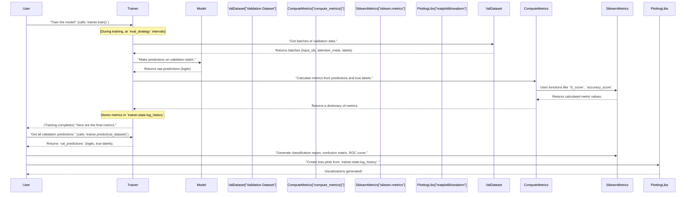

# Step 6: Performance Evaluation & Visualization

 In [Chapter 5: Training](05_training_orchestration_.md), we successfully trained our powerful Transformer model. We set up all the rules and watched it learn from our Tamil text data. That was a huge step!

Now, imagine you've spent hours cooking a brand-new dish. It smells amazing, but how do you know if it *actually tastes good*? You wouldn't serve it without trying it first, right? You'd take a bite, maybe ask a friend for an opinion, and think about what worked and what didn't.

Training an AI model is very similar! Our model has learned, but did it learn well? Is it genuinely good at detecting abusive Tamil text, or is it just guessing? Does it make specific types of mistakes more often than others? This is where **Performance Evaluation & Visualization** comes in.

## What Problem Does Evaluation & Visualization Solve?

The core problem this step solves is: **How do we know if our trained model is effective, and what kind of mistakes is it making?**

For our `Abusive-Tamil-Text-Detection` project, this means answering questions like:
1.  **Is it accurate?** How many abusive/non-abusive texts did it correctly identify overall?
2.  **Is it good at finding abusive texts?** (This is crucial!) Is it missing a lot of abusive content?
3.  **Is it reliable when it says a text is abusive?** Is it accidentally flagging many harmless texts as abusive?
4.  **How did its learning progress over time?** Did it struggle initially, then get better? Did it stop improving or even get worse after a while?

This abstraction provides the methods and tools to answer these questions using both clear numbers (**metrics**) and insightful pictures (**visualizations**).

---

## Key Performance Metrics: Giving Your Model a Scorecard

Metrics are just numbers that help us grade our model's performance. For classification tasks like ours (Abusive vs. Non-Abusive), some metrics are more important than others, especially when one class is rarer (like abusive texts usually are).

Let's look at the main metrics:

### 1. Accuracy: The Overall Correctness Score
*   **What it means**: This is the simplest metric. It tells you the proportion of predictions your model got **correct** out of all predictions made.
*   **Analogy**: If your model looked at 100 texts and correctly identified 80 of them (both abusive and non-abusive), its accuracy would be 80%. It's like your overall score on a test.
*   **Why it's sometimes misleading**: If you have a very imbalanced dataset (e.g., 95 non-abusive, 5 abusive texts), a model could just predict "Non-Abusive" for everything and still get 95% accuracy! It would seem great but would miss all abusive content.

### 2. Precision: How Right Are Your "Abusive" Calls?
*   **What it means**: When your model **predicted "Abusive"**, how many of those predictions were **actually "Abusive"**?
*   **Analogy**: Imagine a doctor who diagnoses "disease X." High precision means that when the doctor says "You have disease X," they are usually correct. This minimizes false alarms (false positives).
*   **Importance for us**: If our model has high precision for the "Abusive" class, it means when it flags a Tamil text as abusive, it's very likely to be truly abusive. This is important to avoid unfairly censoring or flagging users.

### 3. Recall (or Sensitivity): How Many Abusive Texts Did You Find?
*   **What it means**: Of all the texts that were **actually "Abusive"**, how many did your model **correctly identify**?
*   **Analogy**: Using the doctor example, high recall means the doctor successfully identifies most people who *actually* have disease X. This minimizes missed cases (false negatives).
*   **Importance for us**: If our model has high recall for the "Abusive" class, it means it's good at catching most of the abusive content out there. This is crucial for creating a safer online environment.

### 4. F1-score: The Balanced Score
*   **What it means**: The F1-score is a single score that combines both precision and recall. It's especially useful when you want a balance between catching all relevant items (recall) and not having too many false alarms (precision).
*   **Why it's important**: For imbalanced datasets (like ours, where abusive texts are usually rarer), F1-score is often a better indicator of a model's performance than simple accuracy. It penalizes models that favor one class over another too heavily.
*   **Analogy**: It's like a sports reporter giving a player a balanced score based on how well they perform in both offense (finding abusive texts) and defense (correctly identifying them).

---

## Classification Report: A Detailed Summary

Instead of looking at each metric separately, we can generate a **classification report**, which is a neatly formatted table showing all these metrics (precision, recall, F1-score) for each class, plus overall averages.

You might remember defining a `compute_metrics` function in [Step 5: Training](05_training_orchestration_.md). That function calculates these values! Now, we'll use `sklearn`'s `classification_report` to display them beautifully.

```python
import numpy as np
from sklearn.metrics import classification_report, f1_score, accuracy_score, precision_recall_fscore_support
import torch # For softmax, if needed

# ... (Assume val_labels are your true labels from Chapter 2 and Chapter 4) ...
# ... (Assume val_predictions are the outputs from trainer.predict(val_dataset)) ...

# First, get the raw model outputs (logits) and true labels from the prediction result
# val_predictions = trainer.predict(val_dataset) # This line would be run after training
val_logits = val_predictions.predictions # Raw numerical scores from the model
y_true = val_predictions.label_ids # The actual labels

# Convert raw logits into predicted class IDs (0 or 1)
y_pred = np.argmax(val_logits, axis=1)

# Generate and print the classification report
# 'target_names' makes the report human-readable (e.g., "Abusive" instead of "1")
print(classification_report(y_true, y_pred, target_names=["Non-Abusive", "Abusive"]))
```

**What's happening here?**
*   `val_logits`: These are the raw numerical scores output by the model for each class. For example, for a text, it might output `[0.2, 0.8]`, meaning it's 20% sure it's class 0 (Non-Abusive) and 80% sure it's class 1 (Abusive).
*   `y_true`: These are the actual, correct labels for each text in our validation set (0 for Non-Abusive, 1 for Abusive).
*   `np.argmax(val_logits, axis=1)`: This finds the index (0 or 1) of the highest score for each text, which becomes our model's final prediction.
*   `classification_report(...)`: This function takes the true labels (`y_true`) and the model's predictions (`y_pred`) and neatly calculates precision, recall, and F1-score for each class, along with support (number of samples in each class) and overall averages.

**Example Classification Report Output:**
```
              precision    recall  f1-score   support

 Non-Abusive       0.85      0.83      0.84       189
     Abusive       0.82      0.84      0.83       177

    accuracy                           0.84       366
   macro avg       0.84      0.84      0.84       366
weighted avg       0.84      0.84      0.84       366
```
This report clearly shows that our (example) model is doing quite well for both classes, with an overall F1-score and accuracy of 0.84 (or 84%).

---

## Visualizing Model Performance: Seeing the Story

Numbers are useful, but graphs and charts can reveal patterns and insights that plain numbers might hide.

### 1. Confusion Matrix: Where Did It Go Wrong?

*   **What it is**: A confusion matrix is a table that shows how many predictions were correct and how many were incorrect, broken down by *what* was actually true and *what* was predicted. It's a powerful way to see the specific types of mistakes your model is making.
*   **Analogy**: Imagine a detailed scorecard where we track every single decision made by our model. Did it correctly identify an abusive text? Did it mistakenly call a non-abusive text abusive?
*   **Key terms**:
    *   **True Positives (TP)**: Actual Abusive, Predicted Abusive (Correctly identified abusive texts)
    *   **True Negatives (TN)**: Actual Non-Abusive, Predicted Non-Abusive (Correctly identified non-abusive texts)
    *   **False Positives (FP)**: Actual Non-Abusive, Predicted Abusive (Mistakenly flagged non-abusive as abusive - "false alarms")
    *   **False Negatives (FN)**: Actual Abusive, Predicted Non-Abusive (Mistakenly missed abusive content - "missed opportunities")

We use `sklearn.metrics.confusion_matrix` to generate this matrix and `seaborn.heatmap` to make it a visually appealing graph.

```python
import matplotlib.pyplot as plt
import seaborn as sns
from sklearn.metrics import confusion_matrix

# ... (Assume y_true and y_pred are from the classification report step) ...

# Calculate the confusion matrix
cm = confusion_matrix(y_true, y_pred)

# Create a heatmap visualization
plt.figure(figsize=(6, 4)) # Set the size of the plot
sns.heatmap(
    cm,
    annot=True,     # Show the numerical values in each cell
    fmt="d",        # Format numbers as integers
    cmap="Blues",   # Color scheme for the heatmap
    xticklabels=["Non-Abusive", "Abusive"], # Labels for predicted classes
    yticklabels=["Non-Abusive", "Abusive"]  # Labels for actual classes
)
plt.xlabel("Predicted")
plt.ylabel("Actual")
plt.title("Confusion Matrix")
plt.show()
```

**Example Confusion Matrix Heatmap:**
```
           Predicted
           Non-Abusive | Abusive
Actual Non-Abusive | 157         | 32  (TN, FP)
Actual Abusive     | 28          | 149 (FN, TP)
```
(This is a text representation of what the heatmap would visually show)

In this example:
*   157 Non-Abusive texts were correctly predicted as Non-Abusive (True Negatives).
*   149 Abusive texts were correctly predicted as Abusive (True Positives).
*   32 Non-Abusive texts were wrongly predicted as Abusive (False Positives - undesirable).
*   28 Abusive texts were wrongly predicted as Non-Abusive (False Negatives - also undesirable).

### 2. ROC Curve: How Good is the Model at Distinguishing Classes?

*   **What it is**: The Receiver Operating Characteristic (ROC) curve is a graph that illustrates the diagnostic ability of a binary classifier system as its discrimination threshold is varied. In simpler terms, it shows how good our model is at telling the two classes apart at different levels of "certainty."
*   **Analogy**: Imagine a dimmer switch. You can make your model very sensitive (like turning the dimmer all the way up, flagging many things as abusive) or very strict (dimmer down, flagging very few things). The ROC curve shows how well it performs across *all* these different "dimmer settings."
*   **Key terms**:
    *   **True Positive Rate (TPR)**: This is the same as Recall. (How many actual abusive texts were correctly identified).
    *   **False Positive Rate (FPR)**: How many non-abusive texts were wrongly predicted as abusive.
    *   **AUC (Area Under the Curve)**: A single number that summarizes the ROC curve. An AUC of 1.0 means a perfect model. An AUC of 0.5 means the model is no better than random guessing. A higher AUC is generally better.

To plot the ROC curve, we need the model's *prediction probabilities* for the positive class (Abusive), not just the final 0 or 1 prediction.

```python
from sklearn.metrics import roc_curve, auc
import torch

# ... (Assume y_true from classification report step) ...
# ... (Assume val_logits from prediction step) ...

# Get probabilities for the positive class (Abusive, which is label 1)
# torch.softmax converts logits into probabilities.
# [:,1] selects the probability for the 'Abusive' class (index 1).
y_probs = torch.softmax(torch.tensor(val_logits), dim=1)[:, 1].numpy()

# Calculate False Positive Rate (fpr), True Positive Rate (tpr), and thresholds
fpr, tpr, _ = roc_curve(y_true, y_probs)

# Calculate the Area Under the Curve (AUC)
roc_auc = auc(fpr, tpr)

# Plot the ROC curve
plt.figure(figsize=(6, 4))
plt.plot(fpr, tpr, label=f"ROC Curve (AUC = {roc_auc:.2f})")
plt.plot([0, 1], [0, 1], 'k--', label='Random Guessing') # Plot random baseline
plt.xlabel("False Positive Rate")
plt.ylabel("True Positive Rate")
plt.title("ROC Curve")
plt.legend(loc="lower right")
plt.show()
```

**Example ROC Curve Plot (simplified):**
```
^ True Positive Rate (Recall)
|      /
|     /
|    /
|   /  (AUC = 0.85)
|  /
| /
|/________
0-----------> False Positive Rate
```
A curve that hugs the top-left corner (like the example) indicates better performance, as it means the model achieves a high True Positive Rate with a low False Positive Rate.

### 3. Loss Plots: Tracking the Learning Journey

*   **What they are**: These are simple line graphs that show how the model's "error" (loss) decreases (or increases) over the training process. We typically plot two types of loss:
    *   **Training Loss**: The error the model makes on the data it's actively learning from. This should generally go down.
    *   **Validation Loss**: The error the model makes on the unseen validation data. This is crucial for detecting **overfitting** (when the model memorizes the training data but can't generalize to new data). Validation loss should also go down, and if it starts going up while training loss continues to drop, it's a sign of overfitting.
*   **Analogy**: A training loss plot is like watching your student's score on practice quizzes go up. A validation loss plot is like seeing their score on actual, unseen exams. If they do great on practice but terrible on exams, they're just memorizing!

The `Trainer` from Hugging Face conveniently stores the loss values during training in its `state.log_history`. We can extract these and plot them.

```python
# ... (Assume trainer object is available from Chapter 5) ...

# Extract logs from the trainer state
logs = trainer.state.log_history

train_loss = []
eval_loss = []
epochs = [] # Or logging steps, depending on what you want on the x-axis

# Iterate through logs to find training and evaluation loss
for log in logs:
    if "loss" in log and "epoch" in log: # Training loss is usually logged per batch/step
        train_loss.append(log["loss"])
        # epochs.append(log["epoch"]) # You might want to use logging steps instead of epoch here
    if "eval_loss" in log: # Evaluation loss is usually logged per epoch
        eval_loss.append(log["eval_loss"])

# Plot Training Loss
plt.figure(figsize=(6, 4))
plt.plot(train_loss) # X-axis would be logging steps by default
plt.xlabel("Logging Step") # Or "Epoch" if you collected epochs
plt.ylabel("Training Loss")
plt.title("Training Loss Curve")
plt.show()

# Plot Validation Loss
plt.figure(figsize=(6, 4))
# Assuming eval_loss has one value per epoch, x-axis can be 1 to num_epochs
plt.plot(range(1, len(eval_loss) + 1), eval_loss)
plt.xlabel("Epoch")
plt.ylabel("Validation Loss")
plt.title("Validation Loss Curve")
plt.show()
```

**Example Loss Plots (simplified):**
```
^ Loss                     ^ Loss
| /                        | \
|/                         |  \
|__________                |   \
0-----------> Logging Step   0-----> Epoch
(Training Loss)            (Validation Loss)
```
Ideally, both plots should show a decreasing trend, indicating that the model is learning. If validation loss starts to rise, it suggests the model is overfitting, and training should potentially stop earlier.

---

## Under the Hood: The Evaluation Flow

Let's quickly recap how these evaluations fit into our overall training process, especially with the `Trainer` we used in [Step 5: Training](05_training_orchestration_.md).



This diagram shows that the `Trainer` automatically performs evaluations during training using the `compute_metrics` function we provided. After training, we manually use `trainer.predict()` to get all outputs at once and then generate more detailed reports and plots.

### Code References from Project Files:

You can see these evaluation and visualization steps implemented directly in the `indicBert-v2.ipynb` and `xlm-roberta-base-vf.ipynb` files.

#### 1. Prediction on Validation Data:

Both notebooks use `trainer.predict(val_dataset)` to get the model's outputs on the validation set after training.

```python
# From indicBert-v2.ipynb (Fine Tuning section):
# ... (trainer.train() call) ...
val_predictions = trainer.predict(val_dataset)
y_true = val_labels # The original val_labels are used as y_true here
y_pred = val_predictions.predictions.argmax(axis=1)
y_probs = torch.softmax(torch.tensor(val_predictions.predictions), dim=1)[:, 1].numpy() # Probabilities for ROC

# From xlm-roberta-base-vf.ipynb (Validation Prediction section):
# ... (trainer.train() call) ...
val_output = trainer.predict(val_dataset)
val_logits = val_output.predictions
val_probs = torch.softmax(torch.tensor(val_logits), dim=1).numpy()[:, 1]
val_preds = np.argmax(val_logits, axis=1)
```
Both snippets perform the same crucial steps: getting the raw logits, extracting true labels, converting logits to predicted class IDs, and (for ROC) converting logits to probabilities.

#### 2. Classification Report:

Both notebooks then print the `classification_report`.

```python
# From indicBert-v2.ipynb (Fine Tuning section):
print(classification_report(y_true, y_pred, target_names=["Non-Abusive", "Abusive"]))

# From xlm-roberta-base-vf.ipynb (Validation Prediction section):
print(classification_report(val_labels, val_preds))
```
Note that `xlm-roberta-base-vf.ipynb` directly uses `val_labels` as `y_true`, while `indicBert-v2.ipynb` assigns it to `y_true` first. Both are valid.

#### 3. Confusion Matrix:

Both notebooks calculate and visualize the confusion matrix.

```python
# From indicBert-v2.ipynb (Confusion Matrix Heatmap section):
cm = confusion_matrix(y_true, y_pred)
sns.heatmap(cm, annot=True, fmt="d", cmap="Blues", xticklabels=["Non-Abusive", "Abusive"], yticklabels=["Non-Abusive", "Abusive"])
plt.title("Confusion Matrix")
plt.show() # (and plt.savefig)

# From xlm-roberta-base-vf.ipynb (Confusion Matrix section):
cm = confusion_matrix(val_labels, val_preds)
sns.heatmap(cm, annot=True, fmt="d", cmap="Blues", xticklabels=["Non-Abusive", "Abusive"], yticklabels=["Non-Abusive", "Abusive"])
plt.title("Confusion Matrix")
plt.show() # (and plt.savefig)
```
The implementation is nearly identical, demonstrating a standard way to visualize confusion.

#### 4. ROC Curve:

Both notebooks generate and plot the ROC curve.

```python
# From indicBert-v2.ipynb (ROC Curve section):
fpr, tpr, _ = roc_curve(y_true, y_probs)
roc_auc = auc(fpr, tpr)
plt.plot(fpr, tpr)
plt.title("ROC Curve (AUC = %.2f)" % roc_auc)
plt.show() # (and plt.savefig)

# From xlm-roberta-base-vf.ipynb (ROC Curve section):
fpr, tpr, _ = roc_curve(val_labels, val_probs)
roc_auc = auc(fpr, tpr)
plt.plot(fpr, tpr)
plt.title(f"ROC Curve (AUC = {roc_auc:.4f})")
plt.show()
```
Again, a very similar approach. The only difference is in the f-string formatting for the AUC in `xlm-roberta-base-vf.ipynb`.

#### 5. Loss Plots:

Both notebooks extract the loss history from the `trainer` and plot it. `indicBert-v2.ipynb` plots training and validation loss separately, while `xlm-roberta-base-vf.ipynb` plots them separately first and then shows a combined plot. The extraction logic is similar.

```python
# From indicBert-v2.ipynb (Training & Validation Loss Graph section):
logs = trainer.state.log_history
train_loss = []
eval_loss = []
# ... (loop to populate lists, then plot separately) ...

# From xlm-roberta-base-vf.ipynb (Extract Loss Values, Training Loss Plot, Validation Loss Plot, Combined Loss Plot sections):
logs = trainer.state.log_history
train_loss = []
val_loss = []
# ... (loop to populate lists, then plot separately and combined) ...
```
These code snippets directly reflect the concepts explained, demonstrating how to gather the necessary data and use `matplotlib` to visualize the training dynamics.

---

## Conclusion

In this step, we've learned how to thoroughly assess our Transformer model's performance in detecting abusive Tamil text. We covered:
*   Key metrics like **accuracy, precision, recall, and F1-score** to quantitatively measure performance.
*   Generating a **classification report** for a detailed summary of these metrics per class.
*   Visualizing performance with a **confusion matrix** to understand specific types of correct and incorrect predictions.
*   Using the **ROC curve** and **AUC** to evaluate the model's ability to distinguish between classes.
*   Plotting **training and validation loss curves** to monitor the learning process and detect overfitting.

With these tools, we can confidently say whether our model is effective and understand its strengths and weaknesses. Now that we have a well-trained and evaluated model, the final step is to use it to make predictions on new, unseen test data and prepare our submission.

Let's move on to [Step 7: Test Data Prediction and Submission](07_test_data_prediction_and_submission_.md)!

---

<sub><sup>**References**: [[1]](https://github.com/itz-me-pandian/Abusive-Tamil-Text-Detection-Targeting-Women-on-Social-Media-DravidianLangTech-2026/blob/3f1cca4beda0e4410bde305e41221a2c46393ec0/indicBert-v2.ipynb), [[2]](https://github.com/itz-me-pandian/Abusive-Tamil-Text-Detection-Targeting-Women-on-Social-Media-DravidianLangTech-2026/blob/3f1cca4beda0e4410bde305e41221a2c46393ec0/xlm-roberta-base-vf.ipynb)</sup></sub>
