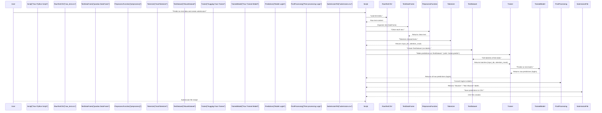

# Step 7: Test Data Prediction and Submission

 In [Step 6: Performance Evaluation & Visualization](06_performance_evaluation___visualization_.md), we learned how to thoroughly assess our Transformer model's performance on a validation set. We used various metrics and visualizations to understand its strengths and weaknesses. That's fantastic! Our model is now well-trained and we know how it performs on data it has *seen during training* (implicitly, through the validation set).

But what about truly **new, unseen data**? In the real world, our model won't have the luxury of knowing the "correct" labels beforehand. Its ultimate purpose is to make predictions on text it has never encountered. This is where **Test Data Prediction and Submission** comes in.

## What Problem Does This Solve?

Imagine our project is a competition to build the best abusive Tamil text detector. You've spent weeks perfecting your model (the trained Transformer from [Step 5: Training](05_training_orchestration_.md)). You've thoroughly taste-tested it on your validation set (from [Step 6: Performance Evaluation & Visualization](06_performance_evaluation___visualization_.md)). Now, the competition organizers gave us a brand-new set of Tamil social media comments – the **test data** – without any labels. Our task is to:

1.  Apply our final, best model to *this* unseen test data.
2.  Predict whether each text is "Abusive" or "Non-Abusive."
3.  Format these predictions into a specific file (usually a CSV) to "submit" your results for final evaluation.

This Step outlines the final steps to achieve this: taking our fine-tuned model, feeding it the new test data, getting its predictions, and preparing them in a structured way. This allows for evaluation of the model's generalization performance, proving it works well on data it has never seen before!

## Key Concepts for Test Data Prediction

The process of making predictions on test data reuses many concepts we've already learned. Here are the key ideas:

1.  **Loading the Test Data**: Just like our training data, the test data typically comes in a structured file (like a CSV) that we need to load into a pandas DataFrame. The crucial difference: **it won't have a 'label' column**.
2.  **Preprocessing and Tokenization**: Our model only understands numbers. So, just as we did for training data (in [Step 2: Data Preparation](02_data_preparation_.md) and [Step 3: Text Tokenization](03_text_tokenization_.md)), we must apply the *exact same* cleaning and tokenization steps to the test texts. Consistency is key!
3.  **Creating a Test Dataset**: We'll use our [Custom PyTorch Dataset](04_custom_pytorch_dataset_.md) class again, but this time, we'll tell it there are no labels.
4.  **Making Predictions with the Trained Model**: We'll use our `Trainer` object (or the model directly) to process the tokenized test data and get its raw numerical predictions (logits).
5.  **Post-processing Predictions**: The raw numerical predictions (logits) need to be converted into final, human-readable labels ("Abusive" or "Non-Abusive").
6.  **Formatting for Submission**: The final step is to organize these predictions into a CSV file with a specific format (e.g., one column for text, one for prediction) as required by the competition or deployment.

## Step-by-Step: Predicting on Test Data

Let's walk through the process with code. We have our `model` (the best version after training) and `tokenizer` loaded from previous Steps.

### 7.1 Loading the Test Data

First, we load our test data CSV file into a pandas DataFrame. Notice it has a `Text` column, but no `Class` or `label` column.

```python
import pandas as pd
import torch
import numpy as np

# Path to our test data CSV file
test_path = "/content/drive/Shareddrives/NLP Task/TestV2 - testV2.csv"

# Load the CSV file into a pandas DataFrame
test_df = pd.read_csv(test_path)

# Display the first few rows to see what it looks like
print("Test data head:")
print(test_df.head())
print(f"\nNumber of test samples: {len(test_df)}")
```
**What's happening here?**
*   `pd.read_csv(test_path)`: This loads our test data, just like we did for the training data in [Step 2: Data Preparation](02_data_preparation_.md).
*   `test_df.head()`: Shows us the first few rows, confirming the data loaded correctly and highlighting the absence of a `Class` or `label` column.

### 7.2 Preprocessing and Tokenization for Test Data

It's absolutely critical to apply the *same* preprocessing (`preprocess` function) and tokenization (`tokenizer`) steps that we used for our training data. This ensures the test data is in the identical format the model expects.

```python
# Assume 'preprocess' function from Step 2 is available
# (Defining it here again for completeness, but typically it would be imported or defined once)
import re
import unicodedata

def preprocess(text):
    text = str(text)
    text = unicodedata.normalize("NFC", text)
    text = text.replace("&#39;", "'")
    text = re.sub(r"\\s+", " ", text).strip()
    text = re.sub(r"[A-Za-z]+", lambda m: m.group(0).lower(), text)
    return text

# Apply the preprocessing function to the 'Text' column of our test DataFrame
test_df["clean_text"] = test_df["Text"].apply(preprocess)

# Assume 'tokenizer' object from Step 3 is available
# (e.g., tokenizer = AutoTokenizer.from_pretrained(model_name))

# Tokenize the cleaned test texts
test_encodings = tokenizer(
    test_df["clean_text"].tolist(), # Use the cleaned texts
    padding=True,                   # Pad all sequences
    truncation=True,                # Truncate long sequences
    max_length=128,                 # Use the same max_length as training
    return_tensors="pt"             # Return PyTorch tensors
)

print("\nFirst tokenized test input IDs (first 5 tokens):")
print(test_encodings['input_ids'][0][:5])
```
**What's happening here?**
*   `test_df["Text"].apply(preprocess)`: We apply the same `preprocess` function to clean the test texts.
*   `tokenizer(...)`: We use our pre-loaded `tokenizer` ([Step 3: Text Tokenization](03_text_tokenization_.md)) with the *exact same parameters* (`padding`, `truncation`, `max_length`) to convert the cleaned text into numerical inputs (input IDs, attention mask, etc.) for the model.

### 7.3 Creating a Test Dataset

We'll use our `AbuseDataset` or `TamilDataset` class from [Step 4: Custom PyTorch Dataset](04_custom_pytorch_dataset_.md) to wrap the tokenized test data. Since test data doesn't have labels, we simply omit the `labels` argument.

```python
import torch
from transformers import AutoTokenizer # Assuming tokenizer is already loaded
from transformers import AutoModelForSequenceClassification, Trainer, TrainingArguments # For Trainer.predict

# Assume AbuseDataset class from Step 4 is available (using the one that tokenizes internally)
class AbuseDataset(torch.utils.data.Dataset):
    def __init__(self, texts, tokenizer, labels=None):
        self.texts = texts
        self.labels = labels
        self.tokenizer = tokenizer

    def __len__(self):
        return len(self.texts)

    def __getitem__(self, idx):
        enc = self.tokenizer(
            self.texts[idx],
            truncation=True,
            max_length=128
        )
        if self.labels is not None:
            enc["labels"] = self.labels[idx]
        return enc

# Create the test dataset
# Note: For the AbuseDataset from xlm-roberta-base-vf.ipynb, we pass raw text,
# and it tokenizes internally. If using TamilDataset from indicBert-v2.ipynb,
# you'd pass test_encodings and None for labels.
test_dataset = AbuseDataset(test_df["clean_text"].tolist(), tokenizer)

print(f"\nTest dataset created with {len(test_dataset)} samples.")
```
**What's happening here?**
*   We create an instance of our `AbuseDataset` (or `TamilDataset`).
*   By not passing `labels`, the `__getitem__` method will only return the input features, which is what `trainer.predict` expects for test data.

### 7.4 Making Predictions

Now, we use our trained `trainer` object (from [Step 5: Training](05_training_orchestration_.md)) to make predictions on the `test_dataset`.

```python
# Assume 'model' and 'trainer' objects are available and the model is on the correct device (e.g., GPU)
# model.to(device) was already executed in indicBert-v2.ipynb just before this section

# Use trainer.predict to get model outputs on the test dataset
test_output = trainer.predict(test_dataset)

# The raw predictions (logits) are in test_output.predictions
test_logits = test_output.predictions

print("\nShape of raw test predictions (logits):", test_logits.shape)
print("First 5 raw predictions (logits):", test_logits[:5])
```
**What's happening here?**
*   `trainer.predict(test_dataset)`: This is the magic line. The `Trainer` handles feeding the `test_dataset` in batches to the `model` and collecting all the raw outputs (logits).
*   `test_logits`: These are the raw numerical scores from the model. For each text, there will be two scores (one for "Non-Abusive" and one for "Abusive"). The higher score indicates the model's preferred class.

### 7.5 Post-processing Predictions and Creating the Submission File

The `test_logits` are raw numbers. We need to convert them into actual class labels ("Abusive" or "Non-Abusive") and then save them into a CSV file.

```python
# Convert raw logits to predicted class IDs (0 or 1)
# np.argmax finds the index of the highest score for each text.
test_preds_ids = np.argmax(test_logits, axis=1)

# Define the mapping from numerical IDs back to human-readable labels
# Assume id2label from Step 1 is available (e.g., id2label = {0: "Non-Abusive", 1: "Abusive"})
id2label = {0: "Non-Abusive", 1: "Abusive"} # Redefining for clarity

# Map the numerical predictions to their string labels
test_preds_labels = [id2label[p_id] for p_id in test_preds_ids]

# Create a pandas DataFrame for submission
submission_df = pd.DataFrame({
    "Text": test_df["Text"],        # Original text from the test file
    "Prediction": test_preds_labels # Our model's predicted label
})

# Save the submission DataFrame to a CSV file
submission_df.to_csv("submission.csv", index=False)

print("\nFirst 5 predictions in submission file:")
print(submission_df.head())
print("\nSubmission file 'submission.csv' created successfully!")
```
**What's happening here?**
*   `np.argmax(test_logits, axis=1)`: For each row of logits (which corresponds to a text), this function tells us which class (index 0 or 1) had the highest score. This gives us our predicted class ID.
*   `[id2label[p_id] for p_id in test_preds_ids]`: We use our `id2label` dictionary (defined in [Step 1: Transformer Model](01_transformer_model_.md)) to convert these numerical IDs (0s and 1s) back into "Non-Abusive" and "Abusive" strings.
*   `pd.DataFrame(...)`: We create a new DataFrame with the original text and our new predictions.
*   `submission_df.to_csv("submission.csv", index=False)`: This saves our DataFrame to a CSV file named `submission.csv`. `index=False` prevents pandas from writing the DataFrame index as a column in the CSV.

## Under the Hood: Test Prediction Flow

Let's visualize the entire process from raw test data to the final submission file.



### Code References from Project Files:

The `indicBert-v2.ipynb` and `xlm-roberta-base-vf.ipynb` notebooks both contain sections dedicated to test data prediction and submission.

#### `indicBert-v2.ipynb` (Testing the Test Data section):

```python
# ... (imports, model_name, tokenizer, model, trainer defined previously) ...

device = torch.device("cuda" if torch.cuda.is_available() else "cpu")
model.to(device) # Ensure model is on GPU for inference

test_df = pd.read_csv(test_path)
test_df["clean_text"] = test_df["Text"].apply(preprocess)

test_encodings = tokenizer(
    test_df["clean_text"].tolist(),
    padding=True,
    truncation=True,
    max_length=128,
    return_tensors="pt"
)

# Move all tensors to device for direct model inference
test_encodings = {k: v.to(device) for k, v in test_encodings.items()}

model.eval() # Set model to evaluation mode
with torch.no_grad(): # Disable gradient calculation to save memory and speed up inference
    outputs = model(**test_encodings)
    preds = torch.argmax(outputs.logits, dim=1).tolist()

inv_label_map = {0: "Non-Abusive", 1: "Abusive", 1: "abusive"} # Note the duplicate '1: "abusive"' entry
test_df["prediction"] = [inv_label_map[p] for p in preds]

test_df[["Text","clean_text","prediction"]].to_csv("/content/drive/Shareddrives/NLP Task/indicbert_submission.csv", index=False)
```
**Differences/Notes for `indicBert-v2.ipynb`:**
*   It directly performs inference using `model.eval()` and `torch.no_grad()` rather than `trainer.predict()`. This is a valid and common alternative for inference.
*   It manually moves the `test_encodings` to the device (GPU) because it's doing direct model inference. The `Trainer` would handle this automatically if `test_dataset` was passed to it.
*   The `inv_label_map` has a redundant `1: "abusive"` entry; `1: "Abusive"` is sufficient if labels are consistent.

#### `xlm-roberta-base-vf.ipynb` (Test Prediction and Create Submission sections):

```python
# ... (imports, MODEL_NAME, tokenizer, model, trainer, AbuseDataset, id2label defined previously) ...

# Create the test dataset using the AbuseDataset class
test_dataset  = AbuseDataset(test_df["Text"].tolist(), tokenizer) # Passes raw text

# Make predictions using the trainer
test_output = trainer.predict(test_dataset)

# Extract predictions and convert to labels
test_preds = np.argmax(test_output.predictions, axis=1)

# Create submission DataFrame
submission = pd.DataFrame({
    "Text": test_df["Text"],
    "Standard": [id2label[x] for x in test_preds] # Use id2label to map
})

# Save to CSV
submission.to_csv("submission.csv", index=False)
```
**Differences/Notes for `xlm-roberta-base-vf.ipynb`:**
*   This notebook uses `trainer.predict(test_dataset)`, which is generally recommended as it handles batching and device placement automatically.
*   The `AbuseDataset` in this notebook takes raw `texts` and the `tokenizer` directly, performing tokenization inside `__getitem__`.
*   The `id2label` dictionary is used for the final mapping.

Both notebooks successfully demonstrate the core process of applying the trained model to unseen test data and formatting the predictions for submission.

## Conclusion

In this final Step, we've completed the task of `Abusive-Tamil-Text-Detection` ! We learned how to:
*   Load raw test data.
*   Apply the exact same preprocessing and tokenization steps used during training.
*   Create a dataset object for our test data.
*   Use our trained Transformer model to make predictions on truly unseen text.
*   Convert these raw numerical predictions into human-readable labels.
*   Format and save our final predictions into a submission-ready CSV file.

You now have a complete understanding of the entire machine learning pipeline, from understanding Transformer models and preparing data, to training, evaluating, and finally, making predictions for real-world scenarios. This task has equipped us with valuable skills for building powerful natural language processing applications!

---

<sub><sup>**References**: [[1]](https://github.com/itz-me-pandian/Abusive-Tamil-Text-Detection-Targeting-Women-on-Social-Media-DravidianLangTech-2026/blob/3f1cca4beda0e4410bde305e41221a2c46393ec0/indicBert-v2.ipynb), [[2]](https://github.com/itz-me-pandian/Abusive-Tamil-Text-Detection-Targeting-Women-on-Social-Media-DravidianLangTech-2026/blob/3f1cca4beda0e4410bde305e41221a2c46393ec0/xlm-roberta-base-vf.ipynb)</sup></sub>
